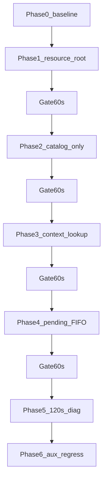

# P0–P2 JJFB Direct Visual Stable (revised)

## Scope (this round)

**auto 240x320 root → full jjfbol catalog → context-aware lookup → reserve/commit bitmap construct → keep real first frame → long observe-only diagnostic.**

**Defer:** real `0x11F00` glyph blit (log calls only). **Never:** inject Event 15 / E6C / B70 / UI_MODE / fixed PC / FAST splash / host fake UI / early `handle.pixels` bind.

**Hard rule:** after every implementation phase, run the 60s Layer-1 first-frame gate. If Layer-1 fails, **stop and bisect that phase** — do not continue stacking modules.



---

## Layer-1 first-frame gate (run after Phase 0–4)

**Product scripts only (no new root one-shot runners):**
- Gate: [`RUN_JJFB_LAUNCHER.ps1`](RUN_JJFB_LAUNCHER.ps1) `-HoldSeconds 60` (+ Layer-1 checks in [`RUN_PRODUCT_DIRECT_JJFB.ps1`](RUN_PRODUCT_DIRECT_JJFB.ps1))
- Prep: [`RUN_VMRP_VISUAL.ps1`](RUN_VMRP_VISUAL.ps1)
- 120s observe: [`research/runners/RUN_JJFB_VISUAL_STABLE_DIAG.ps1`](research/runners/RUN_JJFB_VISUAL_STABLE_DIAG.ps1) (new; research only)
- Multi-game: reuse existing [`RUN_GAMES.ps1`](RUN_GAMES.ps1) / research runners — **do not** add root `RUN_*_VISUAL_SMOKE.ps1`

**Each gate must archive:**
- `runtime_progress.jsonl`
- full stdout/stderr
- `launcher_first_frame.bmp` + SHA-256
- `out/vmrp_run/runtime_process.json` (exact PID)
- member names loaded this run

**Layer-1 PASS (must all hold):**
- `resource_root` resolved to validated tree (Phase 1+: prefer 240x320)
- Phase 2+: `JJFBOL_CATALOG_READY`, `downVersion=1006` when catalog is live
- `DRAW_FP_CALL_ENTER` / `DRAW_FP_DRAWN` ≥ 1, `FIRST_REAL_FRAME_REACHED`
- `runtime_progress` records frame `source=guest_drawfp` (not host test pattern)
- Screenshot **content** checks (not size-only):
  - width/height match guest framebuffer (240×320) or documented present scale
  - non-black pixel ratio > 1%
  - unique pixel values > 16
  - pixel variance above threshold
  - SHA ≠ known blank / host test-pattern hashes
- Alive check uses **`runtime_process.json` → `runtime_pid` only** (never `Get-Process -Name main`)
- No `mr_free invalid`, no `P3_FAULT`
- Alloc storm FAIL if any of:
  - `ALLOC_STORM` flag present
  - same `code+size` alloc > 1000 times in 5s
  - ≥100 consecutive allocs with no DrawFP / resource / event progress

**Layer-2 (Phase 5 report / optional tighten later):** two screenshots 2–5s apart with different SHA or changed active region; distinct members; `0x11F00` calls; natural B54/code15/E6C observe-only.

---

## Phase 0 — Freeze baseline

Current main build, direct `gwy/jjfb.mrp`, 60s Layer-1 (content + PID). Archive artifacts under a dated baseline dir (e.g. `out/visual_baseline/` or `reports/` note).

**If no real first frame → STOP. Do not start refactor.**

---

## Phase 1 — Resource root only

**New:** [`include/gwy_launcher/resource_root.h`](include/gwy_launcher/resource_root.h), [`src/launcher/resource_root.c`](src/launcher/resource_root.c) → `launcher_core`.

**Priority:**
1. Explicit `--root` / `-ResourceRoot`
2. `GWY_RESOURCE_ROOT`
3. default `game_files/mythroad/240x320`
4. scan `game_files/mythroad/*/gwy/jjfb.mrp` **only if** default fails

**Strict fail (no silent fallback):**
- `--root` invalid → FAIL with reason
- `GWY_RESOURCE_ROOT` invalid → FAIL with reason
- default invalid → then scan candidates

**Candidate validation:** `gwy/jjfb.mrp` + `gwy/jjfbol/` + `gwy/jjfbol/downVersion` + cfg36 → `gwy/jjfb.mrp` + SHA from **profile** (not a second hardcoded hash string in resolver).

**Launcher CLI (today only `--debug` / `--diagnostic` / `--test-pattern`):**
```c
char explicit_resource_root[MAX_PATH];
int has_explicit_resource_root;
```
- `JJFB_Launcher.exe --root "...\240x320"`
- `RUN_JJFB_LAUNCHER.ps1 -ResourceRoot "..."`

**SHA/appid/appver:** copy from loaded profile into `LaunchExpectations` (`ex.has_sha256` + `ex.sha256_hex` from `profile.target.expected_sha256`; same for appid/appver). Reuse existing [`launch_descriptor_build`](src/launcher/launch_descriptor.c) closed checks.

**Display split (do not conflate):**
- guest framebuffer / resource dir: 240×320
- host window: keep current profile window scale (320×480) — **only change `resource_root`**, not window size

**Touch:** [`jjfb_launcher_main.c`](src/product/jjfb_launcher_main.c) `resolve_paths`, product PS1s, [`platform_mrp_resource.c`](src/platform/platform_mrp_resource.c) 320x480 fallback, [`profiles/jjfb.json`](profiles/jjfb.json) `resource_root`.

**Then:** 60s Layer-1 gate. Pass → Phase 2.

---

## Phase 2 — Catalog-only (no lookup takeover)

**New:** [`include/gwy_launcher/jjfbol_catalog.h`](include/gwy_launcher/jjfbol_catalog.h), [`src/resources/jjfbol_catalog.c`](src/resources/jjfbol_catalog.c).

Do **not** overload [`gwy_pack_registry`](src/formats/gwy_pack_registry.c).

**Memory policy (mandatory):**
```text
index: mrp_archive_open → copy member name/offset/size/package_index → mrp_archive_close immediately
decode later: reopen with small LRU (4–8 packs), never keep all 59 MrpArchive*data resident
```

Lightweight index only:
```c
typedef struct {
    char path[1024];
    char stem[128];
    uint32_t version;       /* BE from *.mrp.v */
    uint32_t first_member;
    uint32_t member_count;
} JjfbolPackageIndex;
```

Expected log on real tree: `packages=59 versions=60 downVersion=1006 raw=000003EE`.

**This phase must not change 304BF0 / default2 lookup yet** — catalog init + logs only, so a white screen is attributable to catalog init side effects alone.

**Tests split:**
- `tests/unit/test_jjfbol_catalog.c` — temp dir + minimal MRP fixtures (CI-safe; `game_files` not required)
- `research/runners/test_jjfbol_catalog_real.ps1` — local integration: 59/60/1006 against real `game_files`

**Then:** 60s Layer-1 gate. Pass → Phase 3.

---

## Phase 3 — Context lookup + independent jjfbol scope

### Independent scope (do NOT use `package_scope`)

[`package_scope`](src/runtime/package_scope.c) is for top-level MRP → primary EXT (`jjfb.mrp`→`robotol.ext`). It has no `jjfbol/*` rows and returns MISS for subpacks. **Do not hook `package_scope_set_active`.**

**New module** `jjfbol_active_scope` (`jjfbol_scope.h` / `.c`):
```c
void jjfbol_scope_on_open(const char *guest_path);
void jjfbol_scope_on_close(const char *guest_path);
const char *jjfbol_scope_active_package(void);
uint64_t jjfbol_scope_generation(void);
```

Observe real open/close in GuestVFS for `gwy/jjfbol/*.mrp`. Stack/restore on nested open/close; bump generation on new game run and clear stale context.

### Lookup order (strict)
1. active package exact match
2. main `jjfb.mrp` exact match
3. catalog unique **exact** match
4. catalog unique **case-fold** match (only after exact unique fails)
5. multi-hit without context → do **not** complete 304BF0; log full candidate pack list
6. miss → do not complete

Remove `fill_package_candidates` default2-only / `V75_default2_after_jjfb_miss` first-hit blind scan. No force-equal strcmp; keep natural `strcmp==0` postmatch.

### POSTMATCH composite key (not name-only)
```c
typedef struct {
    uint32_t package_id;
    uint64_t package_generation;
    char member_name[256];
} CompletedResourceKey;
```
Dedupe key = `package_id + package_generation + member_name`. Capacity ≥256 of these keys (enlarging name-only `POSTMATCH_MAX` is insufficient).

**Then:** 60s Layer-1 gate. Pass → Phase 4.

---

## Phase 4 — PendingBitmapConstruct reserve/commit FIFO

Replace bytes-only `PIXEL_CACHE_MAX` / `pixels_by_bytes` association.

**Do not dequeue in classify.** Current path: `platform_send_app_event_classify` → `gwy_ext_obs` executor allocates/copies.

```text
classify:  reserve oldest size-matching pending → return pending_id + source_pixels (no delete)
executor: alloc + copy + return OK → commit(pending_id) once
failure:  release(pending_id)
```

Add `uint64_t resource_pending_id` to `GwyPlatCallResult`. Rules:
- only executor commits once
- `platform_send_app_event.c` does not dequeue
- `gwy_ext_obs.c` does not re-match by bytes

**Still never** write `handle.pixels` early (guest owns store). Delete, deprecate, or audit-fail [`platform_mrp_resource_bind_10134_pixels`](src/platform/platform_mrp_resource.c) so it cannot be reintroduced on the product path.

Capacity ≥128 pending entries. Log FIFO depth / reserve-commit mismatches to `runtime_progress`.

**Unit tests:** same-size different members must not cross-wire; reserve without commit leaves entry available; commit removes once.

**Then:** 60s Layer-1 gate. Pass → Phase 5.

---

## Phase 5 — 120s observe-only diagnostic

New: [`research/runners/RUN_JJFB_VISUAL_STABLE_DIAG.ps1`](research/runners/RUN_JJFB_VISUAL_STABLE_DIAG.ps1).

Log: distinct members, active jjfbol package + generation, pending FIFO stats, every `0x11F00` (regs/buffer summary), B54 code15 / `2E2520`/`2E4020`/`2E5E60` / E6C — **observe only**. Layer-2 dual-screenshot hash compare.

---

## Phase 6 — Auxiliary multi-game regression

Only after Phases 0–5. Reuse [`RUN_GAMES.ps1`](RUN_GAMES.ps1) / existing research runners. Confirm GuestVFS / catalog / `0x10134` are not JJFB-hardcoded. JJFB Layer-1 remains the primary acceptance weight.

---

## Forbidden

- Mutate `jjfb.mrp` / `robotol.ext` / `mrc_loader.ext`
- Host enqueue 15, B50→B54 redirect, hardwrite E6C/B70/B71/UI_MODE, fixed guest PC
- FAST splash / host fake UI / early `handle.pixels` bind
- Silent fallback from explicit `--root` / `GWY_RESOURCE_ROOT`
- Reusing `package_scope` for jjfbol subpacks
- Keeping 59 `MrpArchive` bodies resident after index
- New root one-shot visual smoke scripts
- Changing host window size when only resource root should move to 240x320

---

## Implementation order (authoritative)

0. Phase 0 baseline — stop if no frame  
1. Phase 1 resource root → gate  
2. Phase 2 catalog-only → gate  
3. Phase 3 jjfbol scope + lookup + composite POSTMATCH → gate  
4. Phase 4 reserve/commit FIFO → gate  
5. Phase 5 120s research diag  
6. Phase 6 aux regress via existing runners  

Short report under `reports/` per phase gate result. Never claim lifecycle “progress” if Layer-1 frame fails.
