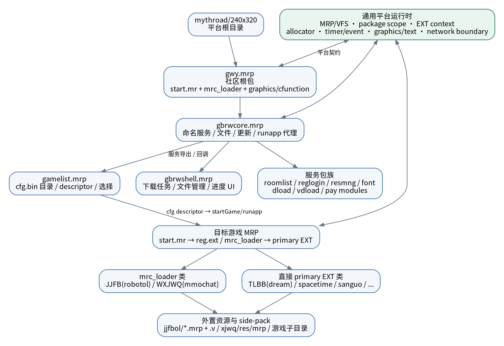
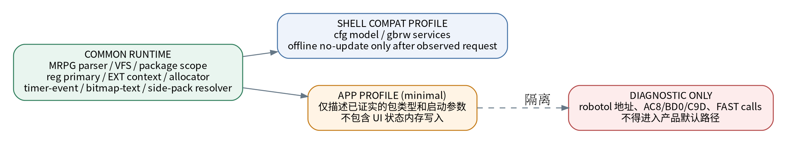
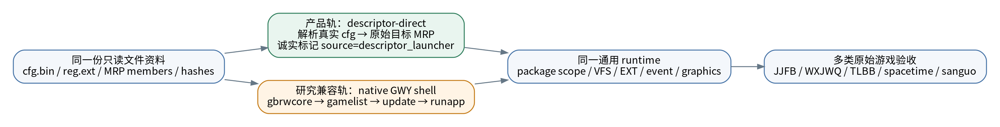

# GWY / MRP 公用启动器专业参考资料（全量静态解析 + 最新运行证据）

**版本：2026-07-21 / Reference Build 1.0**  
**适用项目：`jjfb_pc_vmrp_bootkit` 及同类 Mythroad/GWY 公用启动器**

> 本资料不是围绕单一 `jjfb.mrp` 的故障说明，而是对当前挂载的 `240x320` 原始运行树进行只读全量扫描，并将 GWY 根包、shell、服务包、游戏包、外置资源包和多游戏对照样本统一还原成可实现的启动器契约。

## 0. 交付范围与可信度

- 本次实际扫描输入：`a23491e1-4973-493c-a04f-c455f9a19118.zip`，SHA-256 `850c3181c57bb3867985d7720236e9e3a95ab6df580aa5f894013b55aaa7f3fc`。
- 解压运行树文件：**1601** 个，约 **26.57 MiB**；其中 `gwy/` 文件 **1552** 个。
- MRP：共扫描并成功解析 **134 / 134** 个，解析错误 **0**；其中 `gwy/` 内 130 个，`gwy/*.mrp` 顶层 45 个，根目录另有 4 个 MRP。
- MRP 内成员：**11514**；EXT：**77**；识别 side/resource pack：**65**。
- 全量 CSV、可复跑扫描脚本、实现路线和证据矩阵均随本资料包交付。

证据等级：

| 等级 | 含义 | 使用方式 |
|---|---|---|
| RAW_SCAN | 直接来自原始文件字节、哈希、MRP 索引、成员或字符串 | 可作为实现输入 |
| CROSS_TARGET | 多个包或多个启动模板之间的一致性 | 可作为公用契约强证据 |
| PARSER_MODEL | 从字节规律推导的结构模型，尚非 SDK 文档 | 必须带版本、边界和校验 |
| RUNTIME_OBSERVED | 最新 GitHub 运行日志实际命中 | 可用于确认/证伪静态假设 |
| DIAGNOSTIC_ONLY | 依赖固定地址、FAST/DEBUG assist | 只能定位问题，禁止产品化 |

---

## 1. 执行摘要：最重要的专业结论

### 1.1 这是“共享平台 + 多种包型”，不是每个游戏一套启动器

实际 134 个 MRP 只形成 **8 个 `start.mr` 哈希家族**。最大公共家族覆盖 96 个包；shell/service 主要集中在另外两个家族；`jjfb.mrp` 与 `wxjwq.mrp` 完全共享一个游戏 bootstrap。这个分布说明启动器应按“包型/模板族/运行契约”适配，而不是按游戏名逐个打补丁。

### 1.2 新发现：`gwy.mrp`、`jjfb.mrp`、`wxjwq.mrp` 共用同一个 `mrc_loader.ext`

三者的 `mrc_loader.ext` 解码后 SHA-256 均为：

```text
d36151ee3c119717305afe4b1f0ba47f0f0154f8ba6f2c5081d6402c8eddd938
```

这比“JJFB/WXJWQ 共用 loader”更进一步：**社区根包也使用同一 loader**。因此 `mrc_loader.ext` 应视为平台级 EXT 装载桥，而非 JJFB 特有模块。产品 runtime 中 loader 逻辑必须进入 common layer。

### 1.3 `gwy.mrp:cfunction.ext` 是原始平台装配清单的重要来源

根包只有 8 个成员，但 `cfunction.ext` 内直接引用 `reglogin.mrp`、`dload.mrp`、`gui.mrp`、`rollscr.mrp`、`gamelist.mrp`、`resmng.mrp`、`vdload.mrp`、`pmsg.mrp`、`embfrd.mrp`、`svrctrl.mrp`、`font.mrp` 等。它更接近**平台模块装配器/核心服务入口**，不能只把启动链理解为 `gbrwcore → gamelist`。

### 1.4 `cfg.bin` 存在两个不同版本/角色

- `gwy/gamelist.mrp::cfg.bin`：6898 字节；
- `gwy/hxsg_cfg.bin` 与 `gwy/qqgh_cfg.bin`：与包内 6898 字节版本逐字节相同；
- `gwy/cfg.bin`：20728 字节，内容不同，含 JJFB 当前目录记录。

因此启动器必须区分：**包内 seed/default catalog** 与 **外部 runtime/update catalog**。`gamelist.ext` 同时包含 `gwy/cfg.bin.td` 和 `gwy/cfg.bin`，进一步支持“外部配置可更新/替换”的解释。

### 1.5 最新仓库 `cfg` 解析器在 JJFB 标题字段上存在偏移证据

当前仓库模型用 `record[0x5C:0x70]` 解标题，只得到 `风暴(火爆公测)`；实际 JJFB 记录从 `0x58` 开始可完整解出 `机甲风暴(火爆公测)`。这不是要求立刻把 0x58 写死为全局 ABI，而是要求：

1. 把现有 272 字节记录布局标记为 `PARSER_MODEL`；
2. 为不同 cfg 版本建立 schema/version detector；
3. 对每个字段加入可打印性、目标文件存在性和数值范围校验；
4. JJFB 记录可使用 0x58 作为已验证的目标级证据。

### 1.6 side-pack 是整个资源系统的一等能力

扫描识别 65 个 side/resource pack，且仅 `jjfbol` 就有 59 个 MRP 与 59 个 `.v` 配对文件。资源名普遍采用 `name!W!H@pack.ext`；扫描得到 606 条尺寸化资源。E9W/E9Y 运行证据又确认 `show1!232!100@downimage1.bmp` 通过 `downimage1.mrp` 取原始像素。由此，`@pack` 解析必须属于 common resolver，不能是 JJFB 特例。

### 1.7 推荐双轨，但共享同一 runtime

- **产品轨**：解析真实 cfg/descriptor，诚实标记 `source=descriptor_launcher`，直接启动原始目标 MRP；不依赖已失效的旧 gamelist/update UI。
- **研究兼容轨**：继续恢复 `gbrwcore → gamelist → update/no-update → native runapp`，用于补齐原始 shell 契约。
- 两条轨道必须共享 MRP/VFS、package scope、EXT context、timer/event、graphics、resource resolver；不得维护两套平台。



---

## 2. 全量文件与目录画像

### 2.1 运行树规模

| 指标 | 实测值 |
|---|---:|
| 全部文件 | 1601 |
| 全部大小 | 26.57 MiB |
| `gwy/` 文件 | 1552 |
| MRP 总数 | 134 |
| `gwy/` 内 MRP | 130 |
| `gwy/*.mrp` 顶层 | 45 |
| MRP 内成员 | 11514 |
| EXT 模块 | 77 |
| 资源/side-pack | 65 |

目录不是单一资源仓：`jjfbol`、`xjwq`、`tlbb`、`mhxx`、`ssjx` 等分别采用 MRP 分包、独立二进制资源、脚本/地图/角色资源等不同布局。公用启动器不能假设“所有资源都在主 MRP”。

### 2.2 顶层 45 个 GWY MRP

| basename       |   size_kib |   member_count | class_short   | primary        | start_family   |
|:---------------|-----------:|---------------:|:--------------|:---------------|:---------------|
| ajss.mrp       |      368.2 |             34 | direct_ext    | ajss.ext       | e318e580d789   |
| assg.mrp       |      238.7 |             13 | direct_ext    | assg.ext       | e318e580d789   |
| bbjq.mrp       |      334.8 |             43 | direct_ext    | tlol.ext       | e318e580d789   |
| caccharge.mrp  |      111   |             41 | direct_ext    | caccharge.ext  | 7fc8d5412ac5   |
| cacddz.mrp     |       87   |             58 | direct_ext    | cacddz.ext     | 7fc8d5412ac5   |
| cacddzani.mrp  |       51.1 |             26 | direct_ext    | cacddzani.ext  | 7fc8d5412ac5   |
| caclobby.mrp   |       73.5 |             37 | direct_ext    | caclobby.ext   | 7fc8d5412ac5   |
| caclottery.mrp |      152.2 |             44 | direct_ext    | caclottery.ext | 7fc8d5412ac5   |
| cacpublic.mrp  |       48.8 |             23 | direct_ext    | cacpublic.ext  | 7fc8d5412ac5   |
| cardcharge.mrp |        7.1 |              3 | direct_ext    | cardcharge.ext | aa518953e324   |
| directpay.mrp  |       24.4 |             11 | service       | directpay.ext  | ff67eea7e6ee   |
| dload.mrp      |       10.5 |              3 | service       | download.ext   | 7fc8d5412ac5   |
| embfrd.mrp     |        8.4 |              3 | direct_ext    | embfrd.ext     | 7fc8d5412ac5   |
| font.mrp       |      113.4 |             27 | service       | font.ext       | 343197ddca55   |
| gamelist.mrp   |       70.9 |             26 | shell_core    | gamelist.ext   | ff67eea7e6ee   |
| gbrwcore.mrp   |       97.9 |              3 | shell_core    | gbrwcore.ext   | ff67eea7e6ee   |
| gbrwshell.mrp  |       32.4 |              9 | shell_core    | gbrwshell.ext  | 7fc8d5412ac5   |
| gkdxy.mrp      |      292.8 |              9 | direct_ext    | gkdxy.ext      | e318e580d789   |
| gui.mrp        |       31.3 |             18 | direct_ext    | gui.ext        | 7fc8d5412ac5   |
| hotchat.mrp    |       30   |             17 | direct_ext    | hotchat.ext    | 7fc8d5412ac5   |
| jjfb.mrp       |      404.9 |             50 | mrc_loader    | robotol.ext    | c8d664aa7034   |
| pmsg.mrp       |       14.9 |              7 | service       | pmsg.ext       | ff67eea7e6ee   |
| reglogin.mrp   |       30.3 |             13 | service       | reglogin.ext   | ff67eea7e6ee   |
| resmng.mrp     |       14.3 |              4 | service       | resmng.ext     | ff67eea7e6ee   |
| rollscr.mrp    |       23   |              6 | service       | roll.ext       | ff67eea7e6ee   |
| roomlist.mrp   |       13.3 |              3 | service       | roomlist.ext   | ff67eea7e6ee   |
| sanguo.mrp     |      623.5 |            274 | direct_ext    | sanguo.ext     | e318e580d789   |
| sgmj.mrp       |      403.3 |             35 | direct_ext    | sgmj.ext       | e318e580d789   |
| smd.mrp        |      250.8 |              5 | direct_ext    | smd.ext        | e318e580d789   |
| smsbase.mrp    |        8.7 |              3 | service       | smsbase.ext    | ff67eea7e6ee   |
| smscharge.mrp  |       27.9 |              3 | service       | smscharge.ext  | ff67eea7e6ee   |
| spacetime.mrp  |      477.4 |            422 | direct_ext    | spacetime.ext  | e318e580d789   |
| ssjx.mrp       |      214.6 |            123 | direct_ext    | gameonline.ext | e318e580d789   |
| svrctrl.mrp    |       11.5 |              3 | service       | svrctrl.ext    | ff67eea7e6ee   |
| tlbb.mrp       |      300   |             18 | direct_ext    | dream.ext      | e318e580d789   |
| tyol.mrp       |      469.3 |            617 | direct_ext    | tyol.ext       | e318e580d789   |
| vdload.mrp     |       11.3 |              3 | service       | vdload.ext     | ff67eea7e6ee   |
| wapgame.mrp    |        7   |              3 | direct_ext    | wapgame.ext    | 7fc8d5412ac5   |
| wm2.mrp        |       22.1 |              3 | direct_ext    | wm1_help.ext   | e318e580d789   |
| wm2pet.mrp     |       33.8 |              3 | direct_ext    | wmpk.ext       | e318e580d789   |
| wxjwq.mrp      |      292.1 |             21 | mrc_loader    | mmochat.ext    | c8d664aa7034   |
| xaqd.mrp       |      417.6 |            281 | direct_ext    | wm1.ext        | e318e580d789   |
| xyol.mrp       |      316.6 |             87 | direct_ext    | xiyou.ext      | e318e580d789   |
| yxlm.mrp       |      342.4 |            160 | direct_ext    | xqj.ext        | e318e580d789   |
| zsol.mrp       |      278.9 |             19 | direct_ext    | dream.ext      | e318e580d789   |

> 完整 134 个 MRP 及 11514 个成员见 `data/mrp_archives.csv`、`data/mrp_members.csv`。

---

## 3. MRP / EXT 文件格式与启动契约

### 3.1 MRPG 容器

本次 134 个 MRP 全部满足当前项目使用的 `MRPG` 容器布局：头部包含总长、索引边界、显示名、appid/appver 等字段；成员表由名称长度、名称、offset、stored length 和 reserved 构成；成员可能为 gzip、zlib 或 raw。扫描器对每个成员执行边界校验，并记录解码方式与 SHA-256。

启动器实现必须满足：

1. 源 MRP 只读；
2. archive identity 与 member identity 分离；
3. 解码结果不能脱离所属 package scope；
4. nested/member-view 不能回落到全局同名 `cfunction.ext`；
5. 所有 fallback 必须返回原包字节及可审计 hash。

### 3.2 MRPGCMAP EXT

扫描到的 77 个 EXT 均以 `MRPGCMAP` 开头。当前项目采用 image+8 作为 header entry candidate，这可以作为映射候选，但必须区分：

- module image entry；
- `_mr_c_function_new` 后的 callback continuation；
- raw Thumb function pointer（低位为 1）；
- reg.ext 生成的模块注册入口；
- mrc_loader 转交的 secondary module entry。

错误地把 continuation 当 module entry、或在跨模块调用时错误切换 R9，都会制造“入口已调用但上下文未初始化”的假成功。

### 3.3 `reg.ext` primary 的真实语义

绝大多数原包都含 `reg.ext`，其中可直接提取 primary EXT 字符串。JJFB 的 `reg.ext` 按顺序列出 `robotol.ext` 及多个功能模块，**第一个有效 EXT 是 primary**；WXJWQ 为 `mmochat.ext`；shell 包分别为 `gbrwcore.ext`、`gamelist.ext`、`gbrwshell.ext`。

这要求 runtime：

- 在当前 package 内解析 `reg.ext`；
- 以第一个有效主模块作为 primary；
- 其余模块进入 package-local registry；
- 不允许因字符串扫描顺序错误把 JJFB 的最后一个 `betmodule.ext` 当主模块；
- 不允许使用全局 `dsm:cfunction.ext` 代替包内启动语义。

---

## 4. Bootstrap 家族：公用启动器的最强静态证据

| kind           | sha12        |   count | interpretation                              |
|:---------------|:-------------|--------:|:--------------------------------------------|
| start.mr       | e318e580d789 |      96 | game/resource common bootstrap              |
| start.mr       | ff67eea7e6ee |      15 | shell/service bootstrap A                   |
| start.mr       | 7fc8d5412ac5 |      12 | shell/UI/download bootstrap B               |
| start.mr       | 08be35830b3b |       6 | WXJWQ resource-pack bootstrap               |
| start.mr       | c8d664aa7034 |       2 | shared JJFB/WXJWQ game bootstrap            |
| start.mr       | 343197ddca55 |       1 | font-specific bootstrap                     |
| start.mr       | a2fa65370622 |       1 | GWY root bootstrap                          |
| start.mr       | aa518953e324 |       1 | cardcharge-specific bootstrap               |
| mrc_loader.ext | d36151ee3c11 |       3 | shared mrc_loader (GWY root + JJFB + WXJWQ) |

关键解释：

- `e318...` 覆盖 96 个游戏及资源分包，说明大量直接-primary 包共享同一基础脚本。
- `ff67...` 覆盖 gbrwcore/gamelist、登录、资源管理、roomlist、vdload 等，构成 shell/service A 族。
- `7fc8...` 覆盖 gbrwshell、dload、GUI、部分大厅/支付包，构成 shell/UI B 族。
- `c8d...` 仅 JJFB/WXJWQ，两者 start.mr 逐字节相同。
- 同一个 `mrc_loader.ext` 同时存在于 `gwy.mrp`、JJFB、WXJWQ，证明 loader 需要平台级实现。

建议启动器启动分类器优先使用：

```text
MRP metadata + start.mr hash family + reg.ext primary + mrc_loader presence
```

而不是：

```text
if target == "jjfb.mrp": ...
```

---

## 5. GWY 根包与原始平台装配

### 5.1 `gwy.mrp`

实测：56345 字节、8 个成员：

```text
start.mr | mrc_loader.ext | bubble.bmp | bubble_bk.bmp | sfc.bin | logo.bmp | graphics.ext | cfunction.ext
```

`gwy.mrp` 的 start.mr 自成根包家族，但 `mrc_loader.ext` 与 JJFB/WXJWQ 完全一致。`graphics.ext` 提供绘图/timer/file 相关底层能力；`cfunction.ext` 则直接引用整组 GWY 服务包。

### 5.2 `cfunction.ext` 的模块依赖清单

实际字符串依赖包括：

```text
gwy/reglogin.mrp  gwy/dload.mrp   gwy/gui.mrp      gwy/rollscr.mrp
gwy/gamelist.mrp gwy/resmng.mrp  gwy/vdload.mrp   gwy/pmsg.mrp
gwy/embfrd.mrp   gwy/svrctrl.mrp gwy/font.mrp
graphics.ext     mainext.ext      reg.ext
```

因此更完整的原始理解是：

```text
gwy.mrp 根平台
  ├─ cfunction.ext：模块装配、HTTP/平台服务、子包加载
  ├─ graphics.ext：图形/文件/timer 平台实现
  └─ mrc_loader.ext：向后续 EXT/主模块转交
```

当前只从 `gbrwcore_mr_start` 起步的 shell 测试并没有覆盖根包全部初始化副作用。研究轨需增加 `gwy.mrp` 根包基线，至少比较它对 module registry、P/extChunk、ER_RW/R9、文件服务表和全局参数的初始化差异。

---

## 6. Shell 与服务模块职责拆解

### 6.1 核心包实测表

| basename      | display_name    |   size_kib |   member_count | class_short   | primary       |
|:--------------|:----------------|-----------:|---------------:|:--------------|:--------------|
| gwy.mrp       | [免费]冒泡社区  |       55   |              8 | mrc_loader    |               |
| gbrwcore.mrp  | 冒泡浏览器core  |       97.9 |              3 | shell_core    | gbrwcore.ext  |
| gamelist.mrp  | 游戏大厅        |       70.9 |             26 | shell_core    | gamelist.ext  |
| gbrwshell.mrp | 冒泡浏览器shell |       32.4 |              9 | shell_core    | gbrwshell.ext |
| roomlist.mrp  | 房间列表模块    |       13.3 |              3 | service       | roomlist.ext  |
| reglogin.mrp  | 登录注册模块    |       30.3 |             13 | service       | reglogin.ext  |
| resmng.mrp    | 资源管理模块    |       14.3 |              4 | service       | resmng.ext    |
| font.mrp      | font            |      113.4 |             27 | service       | font.ext      |
| dload.mrp     | 下载模块        |       10.5 |              3 | service       | download.ext  |
| vdload.mrp    | 单机下载插件    |       11.3 |              3 | service       | vdload.ext    |
| directpay.mrp | directpay       |       24.4 |             11 | service       | directpay.ext |
| smscharge.mrp | smscharge       |       27.9 |              3 | service       | smscharge.ext |
| jjfb.mrp      | robotol         |      404.9 |             50 | mrc_loader    | robotol.ext   |
| wxjwq.mrp     | wxjwq           |      292.1 |             21 | mrc_loader    | mmochat.ext   |
| tlbb.mrp      | 天龙八部        |      300   |             18 | direct_ext    | dream.ext     |
| spacetime.mrp | spacetime       |      477.4 |            422 | direct_ext    | spacetime.ext |
| sanguo.mrp    | sanguo          |      623.5 |            274 | direct_ext    | sanguo.ext    |

### 6.2 `gbrwcore.mrp`：命名服务与运行代理

`gbrwcore.ext` 中存在完整 `lib.*` 名称族：

```text
lib.paramCat, lib.runflashmrp, lib.clearlogininfo, lib.savelogininfo,
lib.saveuserinfo, lib.getuserinfo, lib.appfuncasync, lib.appfuncsync,
lib.showMenu, lib.freeze/unfreeze, lib.netpay*, lib.sendsms, lib.alert,
lib.startGame, lib.exitbrw, lib.reportresult, lib.postfiledata,
lib.writefile, lib.fileExist, lib.checkmrpver, lib.isFileOnServerNewer,
lib.getmrpver, lib.getFileVersion, lib.getClientInfo, lib.download,
lib.loadurl, lib.runapp
```

这说明它不是“游戏列表 UI”，而是 shell 的命名服务/export broker。实现时不可把字符串 VA 当函数地址；必须恢复“名称 → dispatcher/export → callback ABI”。

### 6.3 `gamelist.mrp`：目录、descriptor 与入口参数构造

包内 26 个成员包括 UI、`cfg.bin`、`gamelist.ext`、`reg.ext`。关键字符串包括：

```text
gwy/cfg.bin.td
gwy/cfg.bin
gwy/font.mrp
gwy/gbrwcore.mrp
gwy/gbrwshell.mrp
napptype=%d_nurl=%s_gwyblink
napptype=%d_nextid=%d_ncode=%d_narg=%d_narg1=%d_nmrpname=%s_gwyblink
gwy/%s.mrp
```

职责链应拆成：加载外部目录 → 构建记录/列表 → 选择记录 → 拼接 gwyblink descriptor → 调用 gbrwcore named service。

### 6.4 `gbrwshell.mrp`：下载队列和文件任务 UI

它包含 folder/common/back/list/progress 等资源，字符串包含 `gbrw/download`、`DOWNLOADLIST%d`、`TMPDOWNLOADLIST%d`、插件下载 URL。它是下载任务/文件管理 shell，不应被错误当成游戏启动主入口。

### 6.5 `dload` / `vdload`：下载决策与传输

`vdload.ext` 明确包含 `/simpleDownload`、`/continueDownload` 和旧下载主机；`dload.mrp` primary 为 `download.ext`。这支持分层：gamelist/gbrwcore 做检查与决策，dload/vdload 做实际下载，gbrwshell 做队列/UI。

### 6.6 其他服务包

- `reglogin`：登录注册、网络设置和账号 UI；
- `resmng`：资源管理/公共图像；
- `font`：24 个 UC2 分块字库和 font.ext；
- `roomlist`：最小 direct-primary 服务包，适合作为 package context 正控；
- `directpay/smscharge/smsbase`：支付接口；
- `pmsg/rollscr/svrctrl/gui`：消息、滚动、服务控制和公共 UI。

---

## 7. `cfg.bin` 深入解析：版本、记录与 JJFB descriptor

### 7.1 四份 cfg 的关系

| role              | source                    |   size | sha12        |   equals_embedded_seed |   path_hit_count |
|:------------------|:--------------------------|-------:|:-------------|-----------------------:|-----------------:|
| loose_runtime_cfg | gwy/cfg.bin               |  20728 | 0d5837d251e9 |                      0 |               75 |
| embedded_seed_cfg | gwy/gamelist.mrp::cfg.bin |   6898 | 12fdc4f2b835 |                      1 |               66 |
| hxsg_seed_copy    | gwy/hxsg_cfg.bin          |   6898 | 12fdc4f2b835 |                      1 |               66 |
| qqgh_seed_copy    | gwy/qqgh_cfg.bin          |   6898 | 12fdc4f2b835 |                      1 |               66 |

结论：6898 字节版本是包内 seed，并被两个 loose 备份文件复用；20728 字节 `gwy/cfg.bin` 是扩展后的运行目录。启动器应先读取 loose runtime cfg，失败时才考虑 package seed；不能把二者混成一个缓存。

### 7.2 JJFB 记录实测

- 记录索引：`36`；record offset：`10816`；record SHA-256 前 12 位：`4bddb2090e30`。
- 标题（0x58 候选）：**机甲风暴(火爆公测)**；图标：`ng_jjfb.gif`；目标：`gwy/jjfb.mrp`。
- 参数：`napptype=12`、`nextid=482`、`ncode=512`、`narg=0`、`narg1=1`。

对应 descriptor：

```text
napptype=12_nextid=482_ncode=512_narg=0_narg1=1_
nmrpname=gwy/jjfb.mrp_gwyblink
```

### 7.3 解析器必须改成“验证型 schema”，不能直接宣称固定格式

当前 272 字节/1024 base 模型对 JJFB 记录高度吻合，但对旧 seed cfg 和若干 loose cfg 区段不成立，表明 cfg 可能含多段表、不同版本记录或附加尾区。专业实现应：

1. 先枚举 ASCII `gwy/*.mrp` path hit；
2. 依据路径所在窗口测试候选 schema；
3. 用目标存在性、icon 后缀、UTF-16 可打印性、数值范围和记录 hash 打分；
4. 记录 `schema_id` 和 `confidence`；
5. 只在高置信记录上生成 descriptor；
6. 把 0x58 标题起点作为 JJFB 当前版本证据，而不是无条件全局常量。

---

## 8. 游戏包家族与对照样本

### 8.1 mrc_loader 类：JJFB / WXJWQ

| 项 | JJFB | WXJWQ |
|---|---|---|
| 主包 SHA-256 | `52c13182...` | `6ec62841...` |
| start.mr | 同一 SHA `c8d664aa...` | 同左 |
| mrc_loader.ext | 同一 SHA `d36151ee...` | 同左 |
| primary | robotol.ext | mmochat.ext |
| EXT 数 | 21 | 3 |
| 外部资源 | `gwy/jjfbol/` | `gwy/xjwq/` 与 `res/mrp/` |

WXJWQ 是最重要的 mrc_loader 正控：共同失败表示 loader/common runtime 问题；WXJWQ 正常而 JJFB 失败才允许把问题归入 robotol 特有状态。

### 8.2 direct-primary 类

- `tlbb.mrp → dream.ext`：小成员数，适合验证 direct-primary 启动；
- `spacetime.mrp → spacetime.ext`：422 成员，适合资源压力和 member lookup；
- `sanguo.mrp → sanguo.ext`：大型 EXT + 271 资源，适合大映像和绘图；
- `roomlist/vdload`：只有 start/reg/primary 三成员，最适合排除复杂 UI/cfg 干扰。

### 8.3 推荐对照矩阵

| target        | role                        | class_short   | primary       | purpose                                                     |
|:--------------|:----------------------------|:--------------|:--------------|:------------------------------------------------------------|
| gwy.mrp       | platform_root               | mrc_loader    |               | Root shell package; cfunction/graphics bootstrap            |
| gbrwcore.mrp  | shell_api_broker            | shell_core    | gbrwcore.ext  | Export broker, file/update/runapp services                  |
| gamelist.mrp  | catalog_descriptor          | shell_core    | gamelist.ext  | cfg.bin parsing, descriptor construction, selection         |
| gbrwshell.mrp | download_ui                 | shell_core    | gbrwshell.ext | download/task/file-manager shell                            |
| roomlist.mrp  | minimal_shell_control       | service       | roomlist.ext  | small direct-primary shell/service control                  |
| vdload.mrp    | transport_control           | service       | vdload.ext    | small direct-primary network/download control               |
| jjfb.mrp      | mrc_loader_complex          | mrc_loader    | robotol.ext   | target: shared loader + robotol + many modules + side packs |
| wxjwq.mrp     | mrc_loader_positive_control | mrc_loader    | mmochat.ext   | same start/mrc_loader, different main EXT                   |
| tlbb.mrp      | direct_primary_control      | direct_ext    | dream.ext     | single primary dream.ext family                             |
| spacetime.mrp | resource_heavy_control      | direct_ext    | spacetime.ext | single primary with hundreds of resources                   |
| sanguo.mrp    | large_ext_control           | direct_ext    | sanguo.ext    | large primary EXT and many resources                        |

---

## 9. JJFB 内部结构与资源契约

### 9.1 主包拓扑

JJFB 主包 50 个成员：start.mr、共享 mrc_loader、30 个左右首屏/公共资源、`robotol.ext` primary，以及主菜单、聊天、地图、战斗、背包、商店、联盟等 19 个功能模块。`reg.ext` 首先列出 `robotol.ext`，随后列出功能模块。

### 9.2 资源名语法

扫描得到 606 条 `name!W!H[@pack].ext` 资源，JJFB 主包包含：

```text
loadingbar!201!29.bmp  bar!16!18.bmp  textbar!120!30.bmp
slogo!157!58.bmp       target!65!25.bmp top!76!28.bmp ...
```

`jjfbol` 中资源示例：

```text
show1!232!100@downimage1.bmp
blood!141!114@attack.bmp
m1!160!120@bmm1.bmp
cannon3!34!33@cannon1.bmp
```

名称同时携带尺寸和目标 pack，这说明原引擎将资源定位和元数据编码在逻辑名中。resolver 应解析语法、查找 target-local pack registry，再做 exact member resolve；不能依赖 guest 当前索引一定包含所有资源。

### 9.3 `jjfbol` 分包

- 扫描识别 side/resource pack **65** 个；其中 `jjfbol` MRP 59 个，并有同名 `.v` 配对。
- 包名覆盖 default、地图、怪物、武器、翅膀、攻击效果、downimage、bigWorldMap 等。
- `.v` 很可能是版本/状态伴随文件，启动器应纳入只读 inventory 和 cache/version 契约，但不能在未解析格式前写入。

### 9.4 Splash 的正确边界

E9V-E9Z 已证明：透明色、文字测量、原始 bitmap、@pack fallback、workbuf 和 timer 可由通用平台恢复；AC8 等固定地址只是 robotol 内部诊断状态。common runtime 可以实现绘图/资源/事件能力，但不能包含 `AC8/BD0/C9D` 的产品写入逻辑。

---

## 10. 公用启动器必须实现的完整平台契约

### 10.x `MRPG container/parser`
- **归属层：** common runtime
- **必须行为：** strict read-only, index bounds, gzip/zlib/raw
- **禁止耦合：** none

### 10.x `VFS/path normalization`
- **归属层：** common runtime
- **必须行为：** mythroad root, slash variants, package-scoped view
- **禁止耦合：** no target paths hardcoded

### 10.x `package/member identity`
- **归属层：** common runtime
- **必须行为：** archive id, current member view, nested load stack
- **禁止耦合：** none

### 10.x `reg.ext primary`
- **归属层：** common runtime
- **必须行为：** package-local first valid EXT reference
- **禁止耦合：** no JJFB special-case

### 10.x `MRPGCMAP/entry/callback`
- **归属层：** common runtime
- **必须行为：** image mapping, image+8 entry candidate, Thumb bit, continuation distinction
- **禁止耦合：** none

### 10.x `P/extChunk, ER_RW/R9`
- **归属层：** common runtime
- **必须行为：** nest-safe module context provider
- **禁止耦合：** none

### 10.x `allocator/workbuf`
- **归属层：** common runtime
- **必须行为：** guest allocator semantics and collision-free ranges
- **禁止耦合：** none

### 10.x `timer/event/lifecycle`
- **归属层：** common runtime
- **必须行为：** registered callbacks, queue, rearm, ABI-preserving frames
- **禁止耦合：** none

### 10.x `bitmap/text/color-key`
- **归属层：** common runtime
- **必须行为：** generic RGB565, colorkey, measure/draw
- **禁止耦合：** none

### 10.x `side-pack @pack resolver`
- **归属层：** common runtime
- **必须行为：** registry by target root, exact member and original bytes
- **禁止耦合：** no show1/downimage hardcode

### 10.x `cfg.bin record model`
- **归属层：** shell compatibility/profile
- **必须行为：** versioned parser with validation metrics
- **禁止耦合：** do not call documented ABI

### 10.x `gbrw named services`
- **归属层：** shell compatibility/profile
- **必须行为：** named dispatcher and observed update/file/runapp semantics
- **禁止耦合：** no string VA as function pointer

### 10.x `offline no-update`
- **归属层：** shell compatibility/profile
- **必须行为：** only after observed request and exact callback contract
- **禁止耦合：** never fake game login

### 10.x `descriptor launch parameters`
- **归属层：** app descriptor/profile
- **必须行为：** parsed cfg record and source label
- **禁止耦合：** minimal data, no memory state writes

### 10.x `robotol AC8/BD0/C9D addresses`
- **归属层：** diagnostic only
- **必须行为：** breakpoints/traces/FAST experiments
- **禁止耦合：** must never be product default




### 10.1 Package-scoped execution context

每次模块调用至少要携带：archive id、member id、primary/module id、P/extChunk、ER_RW、R9、entry/continuation 类型、Thumb 状态、callback stack、当前 VFS root。跨模块调用必须 push/pop，而不是覆盖一个全局 current module。

### 10.2 文件/VFS ABI

统一 VFS 不等于统一函数参数。host 应在真实平台 API 边界捕获 R0-R3、stack 和 descriptor 候选，再交给 VFS；VFS 本身只处理规范化后的路径和 package scope。

### 10.3 EXT 与回调 ABI

- raw function pointer 低位决定 Thumb；
- PC canonicalization 与 CPSR.T 必须同步；
- LR return sentinel 也要符合 Thumb/ARM；
- R4-R11、R9、SP 和 nested callback frame 必须按 ABI 恢复；
- module entry 与 callback continuation 不得共用同一 R9 switch 规则。

### 10.4 平台服务

最低 common runtime：内存/allocator、文件、timer、事件队列、生命周期、bitmap/sprite、RGB565、color-key、文字 measure/draw、刷新、输入、网络原语与错误返回。对旧 shell 网络可实现“无更新/离线”兼容，但必须在观察到真实请求和 callback contract 后返回；不得伪造游戏服务器登录成功。

---

## 11. 最新 GitHub 运行证据：哪些已经证实，哪些已被证伪

| stage   | subject                                    | status                  | owner_layer                       | action                                         |
|:--------|:-------------------------------------------|:------------------------|:----------------------------------|:-----------------------------------------------|
| E9V     | generic color-key transparency             | OBSERVED                | COMMON_RUNTIME                    | retain                                         |
| E9V     | text measure ABI/layout                    | OBSERVED                | COMMON_RUNTIME                    | retain                                         |
| E9W     | generic @pack resolve and upper image draw | OBSERVED_DEBUG          | COMMON_RESOLVER + DIAGNOSTIC_GATE | retain resolver; reject gate assist as product |
| E9Y     | workbuf allocation                         | OBSERVED                | COMMON_ALLOCATOR/ABI              | retain                                         |
| E9Y     | natural progress timer path                | OBSERVED                | EVENT_RUNTIME                     | timer not AC8 setter                           |
| E9Y-Fix | resource-ready candidate 0x2FE82C          | FALSIFIED               | DIAGNOSTIC                        | stop using as ready event                      |
| E9Z     | resource ready event 0x14                  | FALSIFIED_AS_SUFFICIENT | SHELL_CONTRACT                    | pack ready is necessary but not sufficient     |
| E10A    | descriptor_direct AC8                      | OBSERVED                | PRODUCT_TRACK                     | direct boot still lacks shell-imported state   |
| E10A    | native shell chain                         | PARTIAL                 | RESEARCH_TRACK                    | repair package context/file API and continue   |
| E10A    | current verdict parser                     | INVALID/STALE           | TEST_INFRA                        | add run_id and milestone-gated verdicts        |

关键解释：

- E9V 说明通用视觉平台已经开始成立；
- E9Y 说明 workbuf 和 timer 可以走真实 guest 路径；
- E9Z 证伪“side-pack ready + evt 0x14 就等于 AC8 setter”；
- E10A direct 到 splash 仍 AC8=0，只能说明 descriptor-direct 没带来 shell state；
- E10A shell 只真实记录到 gbrwcore start/continue 和 gamelist load，尚未证明 cfg、update、runapp；
- 当前 E10A verdict 自相矛盾，应先用 run_id + milestone gate 修测试基础设施。

---

## 12. 推荐总体架构与路线



### 12.1 产品轨

```text
scan/index original runtime tree
→ parse cfg descriptor with validated schema
→ source=descriptor_launcher
→ open original target MRP
→ start.mr family
→ package-scoped reg/mrc_loader/primary
→ common lifecycle/resource/graphics/network
```

这条路线绕开的是废弃外壳 UI 和旧更新服务，不绕开原始游戏代码、资源和游戏自身网络。它应成为公用启动器的默认产品模式。

### 12.2 Native shell 研究轨

```text
gwy.mrp root baseline
→ cfunction module assembly
→ gbrwcore named dispatcher
→ gamelist external cfg/update
→ lib.startGame/lib.runapp
→ target MRP
```

这条路线用于恢复最完整兼容性和验证 shell 导入状态，但不能拖住产品轨，也不能把 host direct launch 冒充 native shell。

### 12.3 分阶段实施

| phase   | goal                                | exit_criteria                                                                                |
|:--------|:------------------------------------|:---------------------------------------------------------------------------------------------|
| A       | Reproducible static baseline        | all 134 MRPs parsed; zero errors; source manifest generated                                  |
| B       | Generic package context             | roomlist/vdload/gamelist direct-primary controls all reach primary init without target hacks |
| C       | File/platform ABI                   | no one-byte/invalid paths; same ABI passes shell and game controls                           |
| D       | Product descriptor launcher         | JJFB/WXJWQ/TLBB at least reach primary init through common runtime                           |
| E       | Native shell compatibility research | cfg36 selected and native runapp observed; separate verdict from product track               |
| F       | Resource and graphics completeness  | non-JJFB and JJFB original pixels draw using common APIs                                     |
| G       | Multi-target acceptance             | at least one success per class and no JJFB diagnostic profile on other apps                  |
| H       | Product hardening                   | clean launcher executable, reproducible build, no MRP modifications                          |

---

## 13. 当前最优先的开发任务

### P0：把本资料扫描器纳入仓库

每次提交后对原始 runtime tree 生成 hash baseline；检测 MRP 数量、member、start family、primary、cfg variants 和 side packs 是否变化。

### P1：抽象 `GwyPackageContext`

建议字段：

```c
archive_id, archive_path, member_view_id, primary_member, current_module_id,
P, extChunk, ER_RW, R9, entry_kind, thumb_state, callback_stack, vfs_root,
launch_descriptor, source_label
```

所有 c_load/file/timer/event/platform API 都从 context 获取包身份，禁止隐式全局 JJFB。

### P2：先跑三个最小正控，再跑 gamelist

```text
roomlist.mrp  → 验证 ff67 start + direct primary
vdload.mrp    → 验证同族 + network/file API
tlbb.mrp      → 验证 e318 game bootstrap + direct primary
```

这三者通过后，再用 gamelist 验证 cfg/shell；否则继续在 gamelist 单点调试只会混淆 common ABI 与 shell 逻辑。

### P3：修 cfg parser 为版本化 detector

必须同时处理 6898 seed 与 20728 runtime cfg，输出 schema confidence；修正 JJFB 标题 0x58 证据；只对高置信记录生成 descriptor。

### P4：多游戏产品验收

至少覆盖：

| 类别 | 样本 | 最低验收 |
|---|---|---|
| 根平台 | gwy.mrp | mrc_loader + graphics/cfunction context |
| shell/service | roomlist、vdload、gamelist | primary init；gamelist 进一步到 cfg |
| mrc_loader | JJFB、WXJWQ | 同一 loader，自各 primary init |
| direct-primary | TLBB | dream.ext init |
| resource-heavy | spacetime | 成员/resource 查找 + 首次 draw |
| large EXT | sanguo | 大映像映射 + callback/lifecycle |

---

## 14. 验收与日志规范

每次运行必须生成唯一 `run_id`，并在所有 CSV/stdout/verdict 中携带。Verdict 只能基于本 run_id 和已命中里程碑。

建议通用里程碑：

```text
ARCHIVE_OPEN → START_MR → PRIMARY_RESOLVED → EXT_IMAGE_MAPPED
→ EXT_ENTRY / CONTINUATION → P_EXTCHUNK → ER_RW_R9
→ INIT_RET → HANDLER_REGISTER → EVENT_FIRE
→ FIRST_RESOURCE → FIRST_DRAW → FIRST_REFRESH → STABLE_IDLE/NETWORK_WAIT
```

每个失败必须归类为 container/index、package scope、entry ABI、callback ABI、file ABI、platform API、resource miss、event sequence、network wait 或 app-specific logic，不能只写“没画面”。

---

## 15. 严禁进入产品路径的做法

- 修改原始 MRP/EXT；
- 直接写 AC8、BD0、C9D、progress count 等游戏内部状态；
- host overlay 假画面或编造像素；
- 把资源字符串地址当函数入口；
- 把 direct descriptor launch 标记成 native shell；
- 给非 JJFB 目标开启 JJFB 地址 profile；
- 在未看到 update request 前伪造 no-update；
- 伪造游戏登录/服务器成功；
- verdict 读取旧日志；
- 将调试地址和 FAST assist 留在 common runtime 默认路径。

---

## 16. 附录 A：原始数据产物

本资料包 `data/` 包含：

```text
all_files.csv                    全 1601 文件、大小、SHA-256
directory_stats.csv              目录统计
mrp_archives.csv                 134 个 MRP 元数据/分类/primary/hash
mrp_members.csv                  11514 个成员
ext_modules.csv                  77 个 EXT 的 MRPGCMAP/长度/hash
bootstrap_hash_groups.csv        start.mr 与 mrc_loader 家族
reg_primary_groups.csv           primary 解析
interesting_strings.csv          全量重点字符串
dependency_edges.csv             路径、模块、URL 依赖边
resource_name_grammar.csv        606 条尺寸化资源名
side_pack_registry.csv           side pack 与 .v 配对
cfg_variant_inventory.csv        seed/runtime cfg 版本关系
cfg_path_hits.csv                cfg 内所有 MRP 路径及上下文
cfg_records_parser_model.csv     当前 272 字节模型输出（带证据标记）
control_target_matrix.csv        多类正控样本
common_profile_boundaries.csv    common/profile/diagnostic 边界
latest_evidence_status.csv       E9V-E10A 证据/证伪状态
implementation_roadmap.csv       分阶段路线
```

## 17. 附录 B：来源与可复现性

- 原始运行树：本会话挂载的 `a23491e1-4973-493c-a04f-c455f9a19118.zip`；
- 扫描脚本：`tools/gwy_full_reference_scan.py`；
- 最新仓库证据：`reports/stage_e9v_launcher_visual_parity_verdict.md`、`stage_e9w_splash_full_parity_verdict.md`、`stage_e9y_fix_downimage_event_verdict.md`、`stage_e9z_gwy_resource_ready_verdict.md`、`stage_e10a_gwy_shell_prelaunch_verdict.md` 及 E10A phase/VFS CSV；
- 所有原始游戏文件只读，交付包不包含原始 MRP/EXT 字节，只包含分析、哈希和工具。

## 18. 最终方向判断

**这个项目已经具备做公用启动器的文件基础，且最强证据不是 JJFB 画面，而是 134 个 MRP 形成少数 bootstrap 家族、root/JJFB/WXJWQ 共用 mrc_loader、shell/service 包共享 start 模板，以及资源通过稳定的 package/side-pack 语法组织。**

下一阶段应从“JJFB 固定地址推进”正式转为：

```text
package-scoped common runtime
+ validated cfg descriptor launcher
+ optional native shell compatibility
+ multi-class positive controls
```

只有 robotol 的 AC8/BD0/C9D 等仍留在 diagnostic profile；任何可复用能力都必须先在 roomlist/vdload/TLBB/WXJWQ 等对照目标上证明。