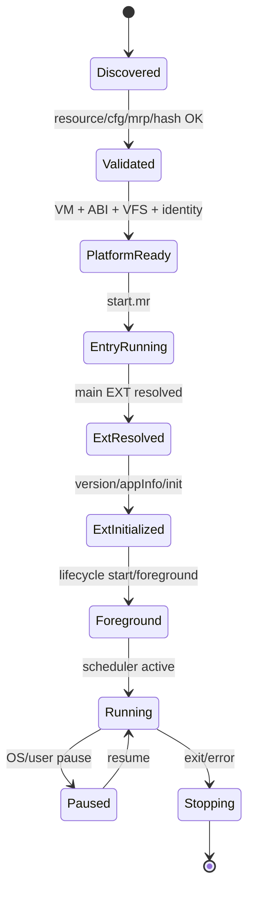

# JJFB/GWY 卡住后的后续参考建议与文件层路线图（D5b+）

> 目的：结合当前卡住包、原始 `网游/gwy` 文件分析资料、前序 Phase 6H–6Q/FullBoot 资料，给 Cursor 一份后续参考建议文档。  
> 重点：不要再原地补 slot、不要 fake runapp、不要为了看画面而推 UI。现在要回答的是：**gamelist init/timer 已活，但为什么没有进入 cfg36 / native runapp / jjfb open。**

---

## 0. 一句话结论

当前不是 `P+0x0C`、ER_RW、R9、timer、draw、slot API 的第一优先问题。  
最新有效状态是：

```text
shell chain reaches gamelist init
natural draw/refresh exists
timer START/FIRE/DONE loop works
post-timer 0x10204/0x10500 class faults cleared
but cfg.bin never opens
gamelist cfg gate never enters
command dispatcher never enters
native_shell runapp never happens
jjfb.mrp never opens
mrc_init not reached
```

所以后续最有希望的路线是：

```text
D5b：找出 gamelist 的“命令/选择输入”来源
→ 证明/触发 command dispatcher 或 cfg gate
→ 让原始 gamelist 自己读取 cfg.bin / 选择 cfg36
→ 再追 native export/runapp
```

如果目标是“尽快启动原始游戏而不是证明完整旧 GWY UI”，则应并行保留第二条路线：

```text
产品轨：独立 launcher 解析 cfg36 和 target descriptor
→ 直接以恢复好的平台 runtime 启动原始 jjfb.mrp / wxjwq.mrp
→ 不模拟 UI，不改游戏逻辑，不 host overlay
```

这不是 fake 游戏；它只是绕开已废弃的 GWY 列表/更新外壳，把资源文件里的启动契约变成新 launcher 的 descriptor。完整旧 shell native runapp 可以继续作为研究轨。

---

## 1. 先统一“当前状态”的判读

### 1.1 报告优先级

上传包里已经提醒：

```text
`fullboot_10_final_verdict.md` and root `CONCLUSION.md` predate Stages D1–D5.
Use `../00_BRIEFING_FOR_GPT.md` and `../verdicts/phase_d5_cfg_gate_verdict.md` as current.
```

因此后续 Cursor 必须按这个优先级读结果：

1. `00_BRIEFING_FOR_GPT.md`
2. `verdicts/phase_d5_cfg_gate_verdict.md`
3. `verdicts/phase_d4_runapp_trigger_verdict.md`
4. `evidence/fullboot_d2_markers_excerpt.txt`
5. 旧 `fullboot_10_final_verdict.md` 只能当历史/过时状态，不作为当前 blocker。

### 1.2 当前真正有效的状态

`00_BRIEFING_FOR_GPT.md` 给出的总体判定：

```text
Overall verdict: PARTIAL
shell chain reaches gamelist init + natural draw + timer fire loop
no native_shell runapp / jjfb open / mrc_init
```

D1–D5 逐步证明：

| 阶段   | 任务                             | 判定               | 核心事实                                                     |
|:-------|:---------------------------------|:-------------------|:-------------------------------------------------------------|
| D1     | timer ABI via sendAppEvent +0x28 | COMPLETE           | chunk-first START/STOP recognized; natural draw retained     |
| D2     | timer fire delivery              | COMPLETE           | FIRE_EXT code=2/mrc_timerTimeout delivered under nested lock |
| D3     | post-timer platform codes        | COMPLETE for fault | 0x10204/0x10500 handled; 9× FIRE_EXT_DONE                    |
| D4     | why timer doesn't runapp         | COMPLETE           | timer path ≠ cfg/runapp; cfg/bin/jjfb opens 0                |
| D5     | cfg gate/cmd dispatcher          | PARTIAL            | cfg gate hits 0; cmd dispatcher hits 0; command source open  |

### 1.3 已经不能再回头怀疑的东西

这些已经是“通过项”或至少不是当前最小 blocker：

- package-scope / member-view 已可用于 `gbrwcore`、`gamelist`、`gbrwshell`、`jjfb`、`wxjwq`；
- `gbrwcore.ext` 的 extChunk、ER_RW、R9 已恢复；
- `gamelist.ext` 已能初始化并注册 slot/timer；
- `sendAppEvent(+0x28)` 已有真实 slot call；
- `0x10102` handler 注册出现；
- 计时器 START/FIRE/DONE 已跑通；
- `0x10204 / 0x10500` post-timer 平台缺口已处理；
- 自然 draw/refresh 在 gamelist init 路径中出现；
- 仍未出现 `native_shell runapp`、`cfg.bin open`、`jjfb open`。

---

## 2. 当前 blocker 的准确命名

建议后续把当前 blocker 命名为：

```text
GAMELIST_COMMAND_SOURCE_NOT_DELIVERED
```

或者：

```text
GAMELIST_CFG36_TRIGGER_NOT_ENTERED
```

不要再叫：

```text
EXTCHUNK_MISSING
ER_RW_MISSING
SLOT_API_MISSING
TIMER_MISSING
RUNAPP_MISSING
```

原因：

- `runapp` 不是直接缺，而是 `cfg36/no_update/post_update` 这条 guest-native branch 根本没被触发；
- `slot` 已有真实调用，但 timer/post-timer path 不走 cfg/runapp；
- `cfg.bin` 文件存在，`gamelist.ext` 里有 `cfg.bin` / 参数格式字符串，但运行时 0 次 open；
- `cmd dispatcher` 和 `cfg gate` PC probes 都 0，说明还没进入“选择游戏/命令处理”路径。

---

## 3. 原游戏文件层证据

### 3.1 核心 MRP 包一览

| basename      |   size |   entry_count | class              | ext_members                                                                                                                                                                                                                                                                                                                                                           | reg_primary_guess   |   start_len | has_mrc_loader_ext   |   asset_count | sha256                                                           |
|:--------------|-------:|--------------:|:-------------------|:----------------------------------------------------------------------------------------------------------------------------------------------------------------------------------------------------------------------------------------------------------------------------------------------------------------------------------------------------------------------|:--------------------|------------:|:---------------------|--------------:|:-----------------------------------------------------------------|
| gbrwcore.mrp  | 100292 |             3 | gwy_shell_core     | reg.ext|gbrwcore.ext                                                                                                                                                                                                                                                                                                                                                  | gbrwcore.ext        |        2490 | False                |             0 | dc7c2134d214e0667174d1806227ea88b41357269e92845d15afdb7f10267b44 |
| gbrwshell.mrp |  33152 |             9 | gwy_shell_core     | reg.ext|gbrwshell.ext                                                                                                                                                                                                                                                                                                                                                 | gbrwshell.ext       |        2240 | False                |             6 | 3cc99e87680b7ebb94dc6f4c3d765d4480a0595650ee97e3c5463400d1819916 |
| gamelist.mrp  |  72620 |            26 | gwy_shell_core     | gamelist.ext|reg.ext                                                                                                                                                                                                                                                                                                                                                  | gamelist.ext        |        2490 | False                |            23 | 4b24babfc82be19015fdf5eb9e2468c7ea030130f61f617a8644ab1e7bf7d956 |
| vdload.mrp    |  11586 |             3 | native_ext_package | reg.ext|vdload.ext                                                                                                                                                                                                                                                                                                                                                    | vdload.ext          |        2490 | False                |             0 | 5089b4f9f5d90b0edd90d9fe8b8b59ba07e28c1c78b00518e9803abdf2942961 |
| jjfb.mrp      | 414602 |            50 | mrc_loader_game    | mrc_loader.ext|bigworldmapmodule.ext|mainmenumodule.ext|mailmodule.ext|moduletest.ext|chatmodule.ext|gezimodule.ext|taobaomodule.ext|gameattackmodule.ext|monsterstatemodule.ext|itembagshopmodule.ext|viewmanmodule.ext|betmodule.ext|monstermodule.ext|leitaimodule.ext|reg.ext|lianmengmodule.ext|othermodule.ext|robotol.ext|shopmodule.ext|itemhechengmodule.ext | robotol.ext         |        3787 | True                 |            54 | 52c13182f87f5ba14bed64589e7f47cb2860a56b32c91fdb25ab13467d5fc036 |
| wxjwq.mrp     | 299067 |            21 | mrc_loader_game    | mrc_loader.ext|reg.ext|mmochat.ext                                                                                                                                                                                                                                                                                                                                    | mmochat.ext         |        3787 | True                 |            17 | 6ec628419bc4c0ca1f8fba37b0c5179961220cd53591fc55eba26735defbd02d |
| tlbb.mrp      | 307238 |            18 | native_ext_package | reg.ext|dream.ext                                                                                                                                                                                                                                                                                                                                                     | dream.ext           |        3435 | False                |            11 | 4aff385218c07c566396dd114f476115e6498325b3a5048900317a42192420e3 |
| spacetime.mrp | 488893 |           422 | native_ext_package | reg.ext|spacetime.ext                                                                                                                                                                                                                                                                                                                                                 | spacetime.ext       |        3435 | False                |           282 | 98845c0c975767e62b0ae3afad7fb4d951f26afd4430b4f90ec4c38937782bac |
| sanguo.mrp    | 638474 |           275 | native_ext_package | reg.ext|sanguo.ext                                                                                                                                                                                                                                                                                                                                                    | sanguo.ext          |      559903 | False                |           271 | c54ec123d15d90060ac2f4fc6b32d277f5b467f75501f32669799c16ac501e23 |

### 3.2 JJFB cfg.bin 记录

| cfg                             |   path_off | path         | pre16_hex                        | post48_hex                                                                                                               |   pre_minus8_u32le_a |   pre_minus4_u32le_b |
|:--------------------------------|-----------:|:-------------|:---------------------------------|:-------------------------------------------------------------------------------------------------------------------------|---------------------:|---------------------:|
| 冒泡游戏320480/网游/gwy/cfg.bin |      10943 | gwy/jjfb.mrp | 0000000001e200000000020000000001 | 6777792f6a6a66622e6d7270000000000000000000000000000000000000000000000000000000000305ffffffffffffffffffffffffffffffffffff |               131072 |             16777216 |

已知启动参数：

```text
napptype=12_nextid=482_ncode=512_narg=0_narg1=1_nmrpname=gwy/jjfb.mrp_gwyblink
```

### 3.3 gamelist.ext 文件层证据

`gamelist.mrp` 文件内确实有：

```text
start.mr
gamelist.ext
reg.ext
bmp/mid/gif/bin assets
```

`reg.ext` primary 为：

```text
gamelist.ext
```

`gamelist.ext` 关键字符串包括：

| member       |   off | s                                                                    |
|:-------------|------:|:---------------------------------------------------------------------|
| gamelist.ext | 81128 | gwy/gifs/                                                            |
| gamelist.ext | 81440 | gwy/                                                                 |
| gamelist.ext | 81580 | gwy/                                                                 |
| gamelist.ext | 81600 | gwy/cfg.bin.td                                                       |
| gamelist.ext | 81616 | gwy/cfg.bin                                                          |
| gamelist.ext | 82100 | gwy/font.mrp                                                         |
| gamelist.ext | 82116 | gwy/gbrwcore.mrp                                                     |
| gamelist.ext | 82136 | gwy/gbrwshell.mrp                                                    |
| gamelist.ext | 82188 | napptype=%d_nurl=%s_gwyblink                                         |
| gamelist.ext | 82220 | napptype=%d_nextid=%d_ncode=%d_narg=%d_narg1=%d_nmrpname=%s_gwyblink |
| gamelist.ext | 82300 | cfunction.ext                                                        |
| gamelist.ext | 82352 | gwyblink                                                             |
| gamelist.ext | 82364 | napptype                                                             |
| gamelist.ext | 82384 | nextid                                                               |
| gamelist.ext | 82392 | ncode                                                                |
| gamelist.ext | 82416 | nmrpname                                                             |
| gamelist.ext | 82428 | gwy/%s.mrp                                                           |
| gamelist.ext | 82448 | %s.mrp                                                               |
| gamelist.ext | 82528 | gwy.mrp                                                              |
| gamelist.ext | 82536 | reglogin.mrp                                                         |
| gamelist.ext | 82552 | resmng.mrp                                                           |
| gamelist.ext | 82564 | dload.mrp                                                            |
| gamelist.ext | 82576 | gamelist.mrp                                                         |
| gamelist.ext | 82592 | gui.mrp                                                              |
| gamelist.ext | 82624 | gwy/                                                                 |
| gamelist.ext | 82632 | gwy\wizard.mrp                                                       |
| gamelist.ext | 82648 | gwy\hotchat.mrp                                                      |
| gamelist.ext | 82684 | gwy/sound/                                                           |
| gamelist.ext | 90044 | Content-Type: application/x-www-form-urlencoded;charset=UTF-8        |
| reg.ext      |   848 | gamelist.ext                                                         |

文件层解释：

- `gamelist.ext` 有 `gwy/cfg.bin`、`gwy/cfg.bin.td` 和 `napptype...nmrpname...gwyblink` 格式；
- 因此它有能力读取 cfg 并构造启动参数；
- 但运行时未进入该分支，不是文件缺失。

### 3.4 gbrwcore.ext 文件层证据

`gbrwcore.ext` 关键字符串：

| member       |    off | s                           |
|:-------------|-------:|:----------------------------|
| gbrwcore.ext | 140244 | lib.startGame               |
| gbrwcore.ext | 140324 | lib.writefile               |
| gbrwcore.ext | 140340 | lib.fileExist               |
| gbrwcore.ext | 140356 | lib.checkmrpver             |
| gbrwcore.ext | 140372 | lib.isFileOnServerNewer     |
| gbrwcore.ext | 140412 | lib.getFileVersion          |
| gbrwcore.ext | 140432 | lib.getClientInfo           |
| gbrwcore.ext | 140452 | lib.download                |
| gbrwcore.ext | 140468 | lib.loadurl                 |
| gbrwcore.ext | 140480 | lib.runapp                  |
| gbrwcore.ext | 140600 | C:/Download                 |
| gbrwcore.ext | 140620 | :/Download                  |
| gbrwcore.ext | 140632 | C:/Download/                |
| gbrwcore.ext | 140648 | :/Download/                 |
| gbrwcore.ext | 140832 | http://                     |
| gbrwcore.ext | 141212 | http://mrp.fm               |
| gbrwcore.ext | 141252 | http/1.1                    |
| gbrwcore.ext | 141284 | http/1.0                    |
| gbrwcore.ext | 142372 | http                        |
| gbrwcore.ext | 142388 | sky_download:               |
| gbrwcore.ext | 142716 | http://                     |
| gbrwcore.ext | 142724 | https://                    |
| gbrwcore.ext | 142764 | http://mrp.fm               |
| gbrwcore.ext | 142812 | cfunction.ext               |
| gbrwcore.ext | 143605 | .mrp                        |
| gbrwcore.ext | 145116 | http://                     |
| gbrwcore.ext | 145668 | http/cookie/cookie          |
| gbrwcore.ext | 145688 | http/cookie                 |
| gbrwcore.ext | 145700 | download                    |
| gbrwcore.ext | 145712 | http                        |
| gbrwcore.ext | 145720 | download/dwnlist.dat        |
| gbrwcore.ext | 145828 | http://sta.proxy.51mrp.com/ |

文件层解释：

- `lib.startGame` / `lib.runapp` 在 `gbrwcore.ext` 中；
- 但这些是字符串/导出名证据，不能直接把 string VA 当函数入口；
- 运行时仍需找到 dispatcher/export call。

### 3.5 gbrwshell.ext 文件层证据

| member        |   off | s                                                                                                                                                             |
|:--------------|------:|:--------------------------------------------------------------------------------------------------------------------------------------------------------------|
| reg.ext       |   608 | gbrwshell.ext                                                                                                                                                 |
| gbrwshell.ext | 39888 | cfunction.ext                                                                                                                                                 |
| gbrwshell.ext | 39968 | http://help.proxy.51mrp.com/help                                                                                                                              |
| gbrwshell.ext | 40004 | http://help.proxy.51mrp.com/feedback                                                                                                                          |
| gbrwshell.ext | 40044 | http://help.proxy.51mrp.com/recommend                                                                                                                         |
| gbrwshell.ext | 41568 | wait.bmp                                                                                                                                                      |
| gbrwshell.ext | 41590 | extred.bmp                                                                                                                                                    |
| gbrwshell.ext | 41612 | dlfail.bmp                                                                                                                                                    |
| gbrwshell.ext | 41634 | dled.bmp                                                                                                                                                      |
| gbrwshell.ext | 41656 | paused.bmp                                                                                                                                                    |
| gbrwshell.ext | 41678 | expnded.bmp                                                                                                                                                   |
| gbrwshell.ext | 41700 | dling.bmp                                                                                                                                                     |
| gbrwshell.ext | 41722 | fmimg.bmp                                                                                                                                                     |
| gbrwshell.ext | 41744 | fmfolder.bmp                                                                                                                                                  |
| gbrwshell.ext | 41766 | fmcmmn.bmp                                                                                                                                                    |
| gbrwshell.ext | 41788 | fmback.bmp                                                                                                                                                    |
| gbrwshell.ext | 41810 | listf.bmp                                                                                                                                                     |
| gbrwshell.ext | 41832 | progbar.bmp                                                                                                                                                   |
| gbrwshell.ext | 41936 | .gif                                                                                                                                                          |
| gbrwshell.ext | 41984 | .bmp                                                                                                                                                          |
| gbrwshell.ext | 42172 | .gif                                                                                                                                                          |
| gbrwshell.ext | 42346 | .bmp                                                                                                                                                          |
| gbrwshell.ext | 42665 | .mrp                                                                                                                                                          |
| gbrwshell.ext | 43908 | http://dmrp.wapproxy.sky-mobi.com/sd?type=2&ver=0&appid=480006&shortname=wmplay&extid=6&mrpname=wmplay.mrp&extname=wmplay.ext&path=/plugins&func=1&param=NULL |
| gbrwshell.ext | 44068 | /plugins/wmplay.mrp                                                                                                                                           |
| gbrwshell.ext | 44108 | gbrw/download                                                                                                                                                 |
| gbrwshell.ext | 44128 | %s/DOWNLOADLIST%d                                                                                                                                             |
| gbrwshell.ext | 44148 | gbrw/download                                                                                                                                                 |
| gbrwshell.ext | 44164 | %s/TMPDOWNLOADLIST%d                                                                                                                                          |

### 3.6 jjfb / wxjwq 对照证据

`jjfb.mrp` 与 `wxjwq.mrp` 是当前最重要的对照：

```text
start.mr SHA 完全一致
mrc_loader.ext SHA 完全一致
```

`mrc_loader_hash_groups.csv`：

| sha256                                                           |   count | members            |
|:-----------------------------------------------------------------|--------:|:-------------------|
| d36151ee3c119717305afe4b1f0ba47f0f0154f8ba6f2c5081d6402c8eddd938 |       2 | jjfb.mrp|wxjwq.mrp |

`jjfb` 关键资源/模块字符串：

| member                |    off | s                        |
|:----------------------|-------:|:-------------------------|
| mrc_loader.ext        |    212 | cfunction.ext            |
| bigworldmapmodule.ext |  16308 | mapcity!150!30.bmp       |
| bigworldmapmodule.ext |  16328 | mapload!23!15.bmp        |
| mainmenumodule.ext    |  26752 | serversel                |
| mainmenumodule.ext    |  27144 | m8!160!120@bmm8.bmp      |
| mainmenumodule.ext    |  27164 | m7!160!120@bmm7.bmp      |
| mainmenumodule.ext    |  27184 | m6!160!120@bmm6.bmp      |
| mainmenumodule.ext    |  27204 | m5!160!120@bmm5.bmp      |
| mainmenumodule.ext    |  27224 | m4!160!120@bmm4.bmp      |
| mainmenumodule.ext    |  27244 | m3!160!120@bmm3.bmp      |
| mainmenumodule.ext    |  27264 | m2!160!120@bmm2.bmp      |
| mainmenumodule.ext    |  27284 | m1!160!120@bmm1.bmp      |
| mainmenumodule.ext    |  27304 | m4!120!160@mainmenu4.bmp |
| mainmenumodule.ext    |  27332 | m3!120!160@mainmenu3.bmp |
| mainmenumodule.ext    |  27360 | m2!120!160@mainmenu2.bmp |
| mainmenumodule.ext    |  27388 | m1!120!160@mainmenu1.bmp |
| mainmenumodule.ext    |  27424 | top!76!28.bmp            |
| mainmenumodule.ext    |  27676 | robot2!165!115.bmp       |
| mainmenumodule.ext    |  27696 | robot1!191!104.bmp       |
| mainmenumodule.ext    |  27716 | menutext!76!80.bmp       |
| mailmodule.ext        |  25744 | fujian!15!15.bmp         |
| mailmodule.ext        |  25764 | money!13!14.bmp          |
| moduletest.ext        |  13984 | @serverDo=true           |
| chatmodule.ext        |  13472 | face!120!12.bmp          |
| gameattackmodule.ext  |  45184 | wy_baoji!120!14.bmp      |
| gameattackmodule.ext  |  45204 | wy_shanbi!44!14.bmp      |
| gameattackmodule.ext  |  45636 | wy_jiaxue!110!12.bmp     |
| gameattackmodule.ext  |  45660 | wy_shanghai!100!12.bmp   |
| gameattackmodule.ext  |  45708 | effect!49!30.bmp         |
| gameattackmodule.ext  |  46276 | shandow!49!17@attack.bmp |
| itembagshopmodule.ext |  42028 | bag_hand!17!16.bmp       |
| itembagshopmodule.ext |  42048 | money!13!14.bmp          |
| viewmanmodule.ext     |  18328 | bag_hand!17!16.bmp       |
| reg.ext               |   2104 | robotol.ext              |
| reg.ext               |   2132 | mainmenumodule.ext       |
| robotol.ext           | 239004 | .mrp                     |
| robotol.ext           | 239048 | default.mrp              |
| robotol.ext           | 239060 | default2.mrp             |
| robotol.ext           | 239076 | default3.mrp             |
| robotol.ext           | 239092 | jiantou_x!12!10.bmp      |
| robotol.ext           | 239112 | jiantou_t!12!10.bmp      |
| robotol.ext           | 239132 | jiantou!12!15.bmp        |
| robotol.ext           | 239152 | wy_jiao5!11!11.bmp       |
| robotol.ext           | 239172 | wy_xian3!15!5.bmp        |
| robotol.ext           | 239192 | wy_jiao32!10!10.bmp      |
| robotol.ext           | 239212 | wy_jiao3!10!10.bmp       |
| robotol.ext           | 239232 | wy_xian2!15!5.bmp        |
| robotol.ext           | 239252 | wy_jiao22!10!10.bmp      |
| robotol.ext           | 239272 | wy_jiao2!10!10.bmp       |
| robotol.ext           | 239292 | wy_xian0!15!6.bmp        |
| robotol.ext           | 239312 | wy_jiao02!10!10.bmp      |
| robotol.ext           | 239332 | wy_jiao0!10!10.bmp       |
| robotol.ext           | 239352 | wy_xian1!15!7.bmp        |
| robotol.ext           | 239372 | wy_jiao12!11!11.bmp      |
| robotol.ext           | 239392 | wy_jiao1!11!11.bmp       |
| robotol.ext           | 239420 | face!120!12.bmp          |
| robotol.ext           | 239520 | boygirl!40!15.bmp        |
| robotol.ext           | 239540 | star!8!8.bmp             |
| robotol.ext           | 239556 | keypress!28!21.bmp       |
| robotol.ext           | 239576 | e!7!9.bmp                |
| robotol.ext           | 239588 | finger!14!12.bmp         |
| robotol.ext           | 239608 | vip!34!12.bmp            |
| robotol.ext           | 239624 | downArrow!14!9.bmp       |
| robotol.ext           | 239644 | updown!28!8.bmp          |
| robotol.ext           | 239660 | upArrow!14!9.bmp         |
| robotol.ext           | 239680 | money!5!10.bmp           |
| robotol.ext           | 239696 | lrarrow!16!14.bmp        |
| robotol.ext           | 239716 | chilunbar!23!23.bmp      |
| robotol.ext           | 239736 | icon1!100!25.bmp         |
| robotol.ext           | 239756 | buttons!36!12.bmp        |
| robotol.ext           | 239776 | bighand!25!25.bmp        |
| robotol.ext           | 239796 | topright!12!4.bmp        |
| robotol.ext           | 239816 | topleft!15!5.bmp         |
| robotol.ext           | 239852 | textbar!120!30.bmp       |
| robotol.ext           | 239872 | bar!16!18.bmp            |
| robotol.ext           | 239888 | loadingbar!201!29.bmp    |
| robotol.ext           | 239912 | gunModel!47!28.bmp       |
| robotol.ext           | 239932 | wingModel!72!41.bmp      |
| robotol.ext           | 239952 | weaponModel!41!42.bmp    |
| robotol.ext           | 239976 | dongModel!28!48.bmp      |

`wxjwq` 关键资源/模块字符串：

| member         |    off | s                                       |
|:---------------|-------:|:----------------------------------------|
| mrc_loader.ext |    212 | cfunction.ext                           |
| reg.ext        |    688 | mmochat.ext                             |
| mmochat.ext    | 305956 | gwy/xjwq/loginserver.sys                |
| mmochat.ext    | 305984 | src\mmochat_serverlist.c                |
| mmochat.ext    | 306012 | gwy/xjwq/                               |
| mmochat.ext    | 306620 | gwy/xjwq/res/mrp/mmochat_mapBaseInfo.rs |
| mmochat.ext    | 306796 | gwy/xjwq/xjwq.res                       |
| mmochat.ext    | 309748 | mmochat.ext                             |
| mmochat.ext    | 309760 | gwy/rollscr.mrp                         |
| mmochat.ext    | 311892 | src\mmochat_update.c                    |
| mmochat.ext    | 311924 | gwy/xjwq/res/                           |
| mmochat.ext    | 311948 | gwy/xjwq/res/mrp/                       |
| mmochat.ext    | 311984 | gwy/xjwq/xjwq.res                       |
| mmochat.ext    | 312004 | %smmochat_res%d.mrp.rs                  |
| mmochat.ext    | 312028 | face1.bmp                               |
| mmochat.ext    | 312050 | face2.bmp                               |
| mmochat.ext    | 312072 | face3.bmp                               |
| mmochat.ext    | 312094 | face4.bmp                               |
| mmochat.ext    | 312116 | face5.bmp                               |
| mmochat.ext    | 312138 | hill1.bmp                               |
| mmochat.ext    | 312160 | hill2.bmp                               |
| mmochat.ext    | 312182 | name1.bmp                               |
| mmochat.ext    | 312204 | name2.bmp                               |
| mmochat.ext    | 312226 | name3.bmp                               |
| mmochat.ext    | 312248 | load1.bmp                               |
| mmochat.ext    | 312270 | load2.bmp                               |
| mmochat.ext    | 312292 | load3.bmp                               |
| mmochat.ext    | 312314 | zhang.bmp                               |
| mmochat.ext    | 313216 | gwy/xjwq/sfc.bin                        |
| mmochat.ext    | 313248 | gwy/xjwq/                               |
| mmochat.ext    | 313312 | line1.bmp                               |
| mmochat.ext    | 313334 | line2.bmp                               |
| mmochat.ext    | 313356 | loghead.bmp                             |
| mmochat.ext    | 313378 | logfra1.bmp                             |
| mmochat.ext    | 313400 | logfra2.bmp                             |
| mmochat.ext    | 313422 | logfra3.bmp                             |
| mmochat.ext    | 313444 | logfra4.bmp                             |
| mmochat.ext    | 313466 | logbutt.bmp                             |
| mmochat.ext    | 313488 | logbutt2.bmp                            |
| mmochat.ext    | 313510 | serbg1.bmp                              |
| mmochat.ext    | 313532 | serbg2.bmp                              |
| mmochat.ext    | 313554 | logser.bmp                              |
| mmochat.ext    | 313576 | light.bmp                               |
| mmochat.ext    | 313598 | loguser.bmp                             |
| mmochat.ext    | 313620 | light2.bmp                              |
| mmochat.ext    | 313642 | rolebg1.bmp                             |
| mmochat.ext    | 313664 | rolebg2.bmp                             |
| mmochat.ext    | 313686 | rolebg3.bmp                             |
| mmochat.ext    | 313708 | rolebg4.bmp                             |
| mmochat.ext    | 313730 | pkbg.bmp                                |
| mmochat.ext    | 313752 | boy1_1.bmp                              |
| mmochat.ext    | 313774 | boy1_2.bmp                              |
| mmochat.ext    | 313796 | boy1_3.bmp                              |
| mmochat.ext    | 313818 | girl1_1.bmp                             |
| mmochat.ext    | 313840 | girl1_2.bmp                             |
| mmochat.ext    | 313862 | girl1_3.bmp                             |
| mmochat.ext    | 313884 | boy2_1.bmp                              |
| mmochat.ext    | 313906 | boy2_2.bmp                              |
| mmochat.ext    | 313928 | boy2_3.bmp                              |
| mmochat.ext    | 313950 | girl2_1.bmp                             |
| mmochat.ext    | 313972 | girl2_2.bmp                             |
| mmochat.ext    | 313994 | girl2_3.bmp                             |
| mmochat.ext    | 314016 | boy3_1.bmp                              |
| mmochat.ext    | 314038 | boy3_2.bmp                              |
| mmochat.ext    | 314060 | boy3_3.bmp                              |
| mmochat.ext    | 314082 | girl3_1.bmp                             |
| mmochat.ext    | 314104 | girl3_2.bmp                             |
| mmochat.ext    | 314126 | girl3_3.bmp                             |
| mmochat.ext    | 314148 | frame.bmp                               |
| mmochat.ext    | 314170 | list.bmp                                |
| mmochat.ext    | 314192 | arrow.bmp                               |
| mmochat.ext    | 314214 | arrow2.bmp                              |
| mmochat.ext    | 314236 | arrow3.bmp                              |
| mmochat.ext    | 314258 | m1.bmp                                  |
| mmochat.ext    | 314280 | m1_s.bmp                                |
| mmochat.ext    | 314302 | m2.bmp                                  |
| mmochat.ext    | 314324 | m2_s.bmp                                |
| mmochat.ext    | 314346 | m3.bmp                                  |
| mmochat.ext    | 314368 | m4.bmp                                  |
| mmochat.ext    | 314390 | m4_s.bmp                                |

解释：

- 如果 full shell `runapp` 能打开 `jjfb`，下一阶段卡在 `mrc_loader/robotol`，则必须同步跑 `wxjwq`；
- `wxjwq` 使用同一 `start.mr` 与同一 `mrc_loader.ext`，但主 EXT 是 `mmochat.ext`，可排除 `robotol` 特有问题；
- 若 `jjfb` 与 `wxjwq` 都卡在相同位置，说明仍是平台/mrc_loader 共同契约问题。

---

## 4. 现在为什么“等 timer”没有意义

D1–D3 已证明 timer 确实能跑：

- `PLATFORM_TIMER START/STOP`；
- `FIRE_EXT code=2`；
- `FIRE_EXT_DONE ret=0`；
- 多轮 5s re-arm。

但 D4/D5 同时证明：

```text
timer path does not reach cfg-open
timer path does not call runapp
cfg gate hits = 0
cmd dispatcher hits = 0
cfg.bin open = 0
```

D5 关键表：

```text
[JJFB_GAMELIST_CFG_GATE] = 0
[JJFB_GAMELIST_CMD_DISP] off=0xF6C4 = 0
cfg.bin open = 0
FIRE_EXT_DONE = 4
```

所以继续延长 quiet boot、继续等 timer，多半只会得到更多：

```text
FIRE_EXT → 0x10204/0x10500 → re-arm
```

不会自然进入 cfg36。

---

## 5. 对当前 gamelist 行为的高概率解释

结合文件层和 D4/D5 结果，`gamelist.ext` 可能不是“启动后自动读 cfg36 并 runapp”，而是：

```text
初始化 UI / 注册 handler / 启动 timer / draw list
等待某种命令、事件、选择、网络/列表消息
收到命令后进入 char/cmd dispatcher
dispatcher 再进入 cfg gate / cfg.bin open
最后构造 cfg36 参数并请求 gbrwcore/runapp
```

D5 中提到 cmd switch 比较 ASCII：

```text
B / H / I / P / S / c / s / p
```

这更像：

```text
命令流 / 协议包 / UI command / 网络响应 / gbrwcore message
```

而不是简单 keepalive timer。

---

## 6. 后续最小实验路线：D5b 命令来源审计

### 6.1 D5b 目标

目标不是直接启动 jjfb，而是先让原始 `gamelist.ext` 第一次进入以下任一日志：

```text
[JJFB_GAMELIST_CMD_DISP]
[JJFB_GAMELIST_CFG_GATE]
[JJFB_RESOURCE_REQUEST] cfg.bin
[JJFB_FILEOPEN] guest="gwy/cfg.bin"
```

只要任一出现，就是重大突破。

### 6.2 D5b 不允许做什么

禁止：

```text
直接 host_runapp
直接打开 jjfb.mrp 当成功
强行跳到 cfg-open 函数
直接修改 gamelist 内存字段
伪造 UI 画面
把 string_va 当函数入口
```

### 6.3 D5b 要新增的报告

```text
reports/d5b_command_source_audit.md
reports/d5b_gamelist_handler_map.md
reports/d5b_cfg_gate_xref.md
reports/d5b_mr_entry_param_consumption.md
reports/d5b_command_dispatch_trigger_result.md
```

---

## 7. D5b 具体执行步骤

### Step 1：把所有 `0x10102` 注册 handler 做成 handler map

从当前证据摘出：

| event_code   | handler   |
|:-------------|:----------|
| 0x10600      | 0x2E74AD  |
| 0x10601      | 0x2E03E1  |
| 0x10602      | 0x2E0421  |
| 0x10603      | 0x2E0359  |
| 0x10604      | 0x2E0445  |
| 0x10605      | 0x2E0361  |
| 0x10606      | 0x2DFC61  |
| 0x1060A      | 0x2DFC59  |
| 0x10608      | 0x2DF699  |
| 0x10609      | 0x2E0405  |

这些是 `gamelist.ext` 初始化时通过 slot `0x10102` 注册的 handler。  
下一步不要只盯 timer helper；要对这些 handler 建表：

```text
event_code
handler_va
handler_module_offset
handler_name_guess
是否被触发
触发来源
是否最终进入 cmd dispatcher/cfg gate
```

Cursor 需要在每个 handler 入口加：

```text
[JJFB_GAMELIST_HANDLER_ENTER] event_code=... pc=... args=...
```

并记录返回：

```text
[JJFB_GAMELIST_HANDLER_RET] event_code=... ret=...
```

### Step 2：追 `cmd dispatcher` 的调用者

D5 已知：

```text
[JJFB_GAMELIST_CMD_DISP] off=0xF6C4
```

下一步必须静态输出：

```text
cmd_dispatcher_va
all direct callers
all literal/table references
all branch callers
all handler-to-dispatch reachability
```

同时运行时加：

```text
[JJFB_GAMELIST_CMD_DISP_ENTER] pc=... caller_pc=... r0=... r1=... r2=... first_bytes=...
[JJFB_GAMELIST_CMD_DISP_CHAR] char=... source=...
```

重点不是一开始就构造命令，而是先知道：

```text
这个 dispatcher 期望的 r0 是 char、buffer、struct，还是 socket/message object？
```

### Step 3：追 cfg gate/cfg-open callsites

D4/D5 已知静态点：

```text
cfg wrap: 0x2D7C80
cfg-open parents: 0x2D7CE4 / 0x2E0F5C / 0x2E1520
other cfg-open callsites: 0x2E11DE / 0x2D829A / 0x2DAB90
gate near cfg path: 0x2D9CBC cmp r0,#0xC
cmd switch: off=0xF6C4
```

Cursor 要输出：

```text
reports/d5b_cfg_gate_xref.md
```

格式：

| site | role | direct caller | runtime hit | input regs | nearest string | branch reason |
|---|---|---|---|---|---|---|

核心判断：

```text
为什么 r0 没有成为 0xC / napptype=12？
这个 r0 应来自 cfg record、command payload、mr_entry 参数，还是 UI selection index？
```

### Step 4：确认 launch param 是否被 guest 读取

现在 host 已经把参数传给 `start_dsm`：

```text
napptype=12_nextid=482_ncode=512_narg=0_narg1=1_nmrpname=gwy/jjfb.mrp_gwyblink
```

但 D4 说这不等于 guest sprintf/consume。

新增：

```text
[JJFB_PARAM_MAP] va=... len=...
[JJFB_PARAM_READ] pc=... module=... off=... bytes=...
[JJFB_PARAM_PARSE_HINT] key=napptype/nextid/nmrpname ...
```

如果 45s 内 0 次读取：

```text
launch param is not consumed by gamelist init/timer
```

那就说明需要别的 command/event source。

### Step 5：审 `mr_entry` / table[144]

D5 明确留下开放问题：

```text
mr_entry / table[144] consumption missing
```

Cursor 要静态/动态查：

```text
_mr_entry
mr_entry
table[144]
entry string
p_mr_param
event registration table
```

目标：

```text
reports/d5b_mr_entry_param_consumption.md
```

必须回答：

1. `gamelist.ext` 是否读 runtime param；
2. runtime param 是否进入 command dispatcher；
3. `table[144]` 是不是一个命令/事件入口；
4. 当前 runtime 有没有漏发 `MR_ENTRY`/foreground/resume 类事件。

---

## 8. D5c：只在有证据时送“真实平台事件”

如果 D5b 发现某个 `0x10102` handler 是 key/input/selection/event 类型，可以做 D5c。  
D5c 的原则：

```text
通过平台 event/scheduler 送事件，不直接改 guest 内存，不直接跳 PC。
```

候选：

```text
OK / select key
list item confirm
foreground/resume
mr_entry parameter delivery
network/message receive callback
```

每个候选都必须有来源：

- DOCUMENTED：SDK/平台事件定义；
- CROSS_TARGET：多个 MRP 注册相同 code/handler；
- TARGET_OBSERVED：gamelist 当前 handler map；
- HYPOTHESIS：只能跑 observe，不进入 core default。

成功不是“画面变了”，而是：

```text
cmd dispatcher hit
cfg gate hit
cfg.bin open
```

---

## 9. D5d：如果 command 来自网络/更新响应

`gamelist.ext` 可能等待旧 GWY 服务返回的列表/选择命令。  
当前 `initNetwork` stub 只是：

```text
MR_SUCCESS_sync / no_update
```

如果静态发现 cmd dispatcher 由网络 receive path 触发，下一步不是 fake server login，而是：

```text
构造最小“本地 shell command source”，让 gamelist 消费本地 cfg/list 选择
```

必须区分两种东西：

```text
外壳更新/列表服务：可 no_update/offline stub
游戏自身服务器：不能 fake 登录成功
```

这里可以允许 shell 层 no_update，因为它只是过期 GWY 外壳服务；但不能伪造 jjfb 游戏服务器成功。

---

## 10. 原始 shell 路线与产品路线的建议

### 10.1 研究轨：继续证明原始 gamelist → cfg36 → native runapp

适合目标：

```text
必须证明 gbrwcore/gamelist/gbrwshell 原始 shell 亲自调用 runapp
```

下一步就是 D5b/D5c。  
优点是最“原生 shell”；缺点是可能陷入旧 GWY UI/命令/网络协议细节。

### 10.2 产品轨：独立 launcher 直接启动原始目标 MRP

适合目标：

```text
尽快让原始 jjfb/wxjwq 游戏本体正常加载
```

这个路线不是模拟游戏，也不是 host overlay。  
它做的是：

```text
读取 cfg.bin / reg.ext / MRP descriptor
建立 platform runtime
直接执行 target start.mr + mrc_loader + main EXT
```

它绕开的是：

```text
废弃的 GWY gamelist/update/list UI
```

不绕开：

```text
原始游戏 MRP
原始 robotol/mmochat
原始资源
原始 mrc_init
```

这条路线在 `plan/17_TWO_TRACK_RESEARCH_METHOD.md` 里已经明确建议：

```text
不把 gbrwcore.mrp、gbrwshell.mrp、gamelist.mrp、vdload.mrp 作为日常启动依赖；
只读解析它们保留下来的 cfg、资源和启动契约；
新启动器自己完成游戏选择后的“最后一公里”。
```

### 10.3 我的建议

并行，但优先级这样排：

1. **短期继续 D5b**：因为离 `cfg36` 只差命令源，值得再做一个强判别实验；
2. **同时准备产品轨**：若 D5b 证明命令源来自旧网络/复杂 UI 协议，立即切产品轨，直接启动 `jjfb/wxjwq`；
3. **用 wxjwq 做 sanity check**：它和 jjfb 共用 mrc_loader，失败能快速判断是平台还是 robotol。

---

## 11. Cursor 下一轮最推荐任务文档

下面这段可以直接交给 Cursor：

```text
任务名：D5b_GAMELIST_COMMAND_SOURCE_AUDIT

当前状态：
- shell reaches gamelist init；
- gamelist natural draw/refresh exists；
- EXT timer START/FIRE/DONE works；
- 0x10204/0x10500 handled；
- cfg.bin open = 0；
- cmd dispatcher off=0xF6C4 hit = 0；
- native_shell runapp = 0；
- jjfb open = 0。

禁止：
- host_runapp；
- 直接打开 jjfb 当成功；
- force UI/AC8/progress；
- 跳到 cfg-open；
- fake network/game login；
- 把 string_va 当函数入口。

目标：
找出 gamelist cfg36/runapp 分支的真实触发源。

必须实现：
1. map all 0x10102 handlers；
2. add handler enter/return logs；
3. build static xref for cmd dispatcher off=0xF6C4；
4. build static xref for cfg-open/gate sites:
   0x2D7C80, 0x2D7CE4, 0x2E0F5C, 0x2E1520,
   0x2E11DE, 0x2D829A, 0x2DAB90, 0x2D9CBC；
5. trace launch param VA reads；
6. audit mr_entry/table[144]/p_mr_param consumption；
7. run 45s quiet boot；
8. produce verdict:
   - TIMER_ONLY_CONFIRMED_DEAD；
   - PARAM_NOT_CONSUMED；
   - HANDLER_SOURCE_FOUND；
   - CMD_DISP_ENTERED；
   - CFG_GATE_ENTERED；
   - NETWORK_COMMAND_SOURCE_REQUIRED。

成功标准：
出现任一：
[JJFB_GAMELIST_CMD_DISP]
[JJFB_GAMELIST_CFG_GATE]
[JJFB_FILEOPEN] guest="gwy/cfg.bin"
[JJFB_GAMELIST_CFG36_BUILD] param=...
```

---

## 12. 如果 D5b 仍然 0 命中，下一步不要继续盲等

如果 D5b 后仍然：

```text
handler enter 有，但 no cmd/cfg
或者 handler 都不进
或者 param 从不读取
或者 cfg gate/cmd disp 仍 0
```

则下一步不应继续“跑久一点”。  
应转入 D6：

```text
D6_PRODUCT_DESCRIPTOR_DIRECT_BOOT
```

目标：

```text
直接以 cfg36 descriptor 启动原始 jjfb/wxjwq 目标；
不依赖 gamelist UI；
不修改游戏；
不 host overlay；
复用已恢复 platform runtime。
```

D6 成功标准：

```text
gwy/jjfb.mrp natural open
start.mr executes
mrc_loader.ext loaded
robotol.ext loaded
mrc_init reached
```

若 jjfb 卡在 robotol，则立即跑：

```text
gwy/wxjwq.mrp
```

成功标准：

```text
mrc_loader.ext loaded
mmochat.ext loaded
mrc_init/equivalent reached
```

---

## 13. D6 产品轨任务说明

Cursor 可执行：

```text
任务名：D6_PRODUCT_DESCRIPTOR_DIRECT_BOOT
```

输入：

```text
cfg index=36
target=gwy/jjfb.mrp
param=napptype=12_nextid=482_ncode=512_narg=0_narg1=1_nmrpname=gwy/jjfb.mrp_gwyblink
primary=robotol.ext
mrc_loader.ext sha=d36151ee3...
target hash=52c13182...
```

要求：

```text
1. 不走 gbrwcore/gamelist runapp；
2. 但要复用同一 platform context provider：
   extChunk, ER_RW/R9, package-scoped c_load, member_view, VFS, timers, draw；
3. 启动原始 jjfb.mrp；
4. cfunction.ext 按 reg primary / mrc_loader 语义解析到 robotol.ext；
5. 不修改 MRP；
6. 输出完整 mrc_loader/robotol/mrc_init report。
```

注意命名要诚实：

```text
source=descriptor_launcher
not source=native_shell
```

这不能冒充 native shell runapp，但能满足“原始游戏本体自然启动”的目标。

---

## 14. 当前所有“不要做”的清单

不要做：

```text
继续只等 timer
扩大 slot matrix
补不存在的 runapp shortcut
host_runapp_equivalent
让 host 直接画 splash
force ui_mode/AC8/progress
写死 jjfb guest 地址
改 jjfb.mrp/robotol.ext
把 cfg36 字符串出现当作 cfg36 branch 成功
把 fullboot_10 旧报告当当前状态
```

---

## 15. 当前最值得保留的证据摘录

### 15.1 D5 结论

# Stage D5 — cfg.bin gate (partial)

- **task:** RESEARCH_ONLY — why guest never opens `gwy/cfg.bin`
- **verdict:** `PARTIAL` — timer/init path falsified; command-dispatch path never entered
- **evidence:** TARGET_OBSERVED

## Discriminating result (45s quiet boot)

| Probe | Hits |
|-------|------|
| `[JJFB_GAMELIST_CFG_GATE]` (cfg-open / gate / wrap) | **0** |
| `[JJFB_GAMELIST_CMD_DISP]` (`off=0xF6C4` char switch) | **0** |
| `cfg.bin` open | **0** |
| `FIRE_EXT_DONE` | **4** |

Instrumentation: module-relative offsets in `ext_gwy_shell_native_exec.c` (same style as `GAMELIST_OFF_CFG36_FMT`).

## Hypotheses after D5

| ID | Claim | Status |
|----|--------|--------|
| A | Timer FIRE reaches cfg-open | **FALSIFIED** (D4 callgraph + D5 PC probe) |
| B | Init path reaches cfg-open | **FALSIFIED** (0 gate hits through init + 4 ticks) |
| C | Command/char dispatcher (`'B'/'H'/'S'/'c'/…` @ cmd switch) must run first | **OPEN** — never entered in Full Boot |
| D | `mr_entry` / table[144] consumption missing | **OPEN** — no `_mr_entry` / `mr_entry` in log |

## Static notes (TARGET_OBSERVED)

- Sole `bl` to cfg-gate `0x2D7C80` is tiny wrap @ off `0xF670`; **no** other `bl`/`b`/literal/`movw` to that wrap found (may be dead or reached only via runtime table).
- Other cfg-open call sites exist (`0x2E11DE`, `0x2D829A`, `0x2DAB90`, …) but also never hit.
- Nearby cmd switch compares bytes to ASCII `B/H/I/P/S/c/s/p` — looks like a protocol/command stream, not keepalive timer.

## Anti-drift

- `audit_launcher_core.py` → ok
- No host_runapp / UI force / jjfb patch

## Next smallest experiment (D5b)

**Question:** What DOCUMENTED/CROSS_TARGET input delivers the command stream (or calls into cmd-disp / cfg-wrap) after gamelist init — network payload, `mr_entry` parse, DSM event, or gbrwcore export — without injecting fake UI state?

**Success:** first `[JJFB_GAMELIST_CMD_DISP]` or `[JJFB_GAMELIST_CFG_GATE]` or `cfg.bin` `[JJFB_RESOURCE_REQUEST]`.


### 15.2 D4 结论摘要

# Stage D4 — why gamelist timer does not call native_shell runapp

- **task:** RESEARCH_ONLY → SCHEDULER/RUNTIME gate finding
- **verdict:** `COMPLETE` (discriminating cause found); Stage D runapp still open (`PARTIAL`)
- **evidence:** TARGET_OBSERVED + CROSS_TARGET strings; MasterPlan Stage C/D

## Classification

| Claim | Level |
|-------|--------|
| Periodic timer FIRE path ≠ runapp | TARGET_OBSERVED |
| `gamelist.ext` has `gwy/cfg.bin` + cfg36 format strings, no `runapp`/`startGame` literals | TARGET_OBSERVED |
| Post-init: 0 opens of `cfg.bin` / `jjfb.mrp` | TARGET_OBSERVED |
| `cfg.bin` exists on host (`game_files/.../gwy/cfg.bin`, 20728 bytes) | CROSS_TARGET resource |
| Static callgraph: timer handler `0x2E7754` does **not** reach cfg-open callees | TARGET_OBSERVED |
| Cfg-open parents `0x2D7CE4` / `0x2E0F5C` / `0x2E1520` never appear in Full Boot PC log | TARGET_OBSERVED |
| Gate near cfg path compares `r0` to `0xC` (12 = napptype) @ `0x2D9CBC` | TARGET_OBSERVED / HYPOTHESIS on field meaning |

## Proven

1. Timer cycles (D2/D3) only: `0x10204` / `0x10500` + re-arm `period_ms=5000` — no export/runapp.
2. After `After app init`: `cfg.bin` opens = **0**, `jjfb.mrp` opens = **0**, guest-built `[JJFB_GAMELIST_CFG36_BUILD] param=` = **0** (only format_string_mapped at map time).
3. `gamelist.ext` strings include `gwy/cfg.bin`, `napptype=%d_..._nmrpname=%s_gwyblink`, `gwy/%s.mrp`; **zero** `runapp` / `startGame` / `lib.run`.
4. Callgraph: registered `0x10102` handlers + timer `0x2E7754` → `reaches_cfg=False`. Cfg path entered only via `0x2D7CE4` / `0x2E0F5C` / `0x2E1520` (never hit in boot log).
5. Launch param is passed into `start_dsm` (`GWY_LAUNCH_PARAM` / entry) but is **not** proof that guest sprintf’d/consumed cfg36 for jjfb.

## Not yet / blocker

- No `[JJFB_RUNAPP] source=native_shell` / `[JJFB_SHELL_EXPORT_CALL]`.
- Cfg/no_update/post_update branch never runs; MasterPlan Stage C logs absent as *guest-observed* (only host update stub).
- Side notes (not proven gates): `gb16.uc2` MISS; `mr_plat(1327)` → `MR_IGNORE`; init continues after both.

## Next smallest experiment (D5)

See `phase_d5_cfg_gate_verdict.md`: PC probes show cfg-gate and cmd-dispatch **never** enter under timer-only Full Boot (4× `FIRE_EXT_DONE`, still 0 `cfg.bin` opens).

### 15.3 D2/D3 有效 timer 证据

```text
D2: FIRE_EXT code=2 helper=0x2E3089 P=0x2AC8DC chunk=0x682A5C
D3: 9× successful FIRE_EXT / FIRE_EXT_DONE cycles
D3: 0x10204 / 0x10500 platform class handled
```

### 15.4 文件层启动契约

# GWY Launcher 的启动契约

## 1. JJFB 已知配置

```text
cfg index = 36
title slice in cfg = 风暴(火爆公测)
product name       = 机甲风暴（由资源/既有记录识别，勿混同字段原文）
icon      = ng_jjfb.gif
target    = gwy/jjfb.mrp
napptype  = 12
nextid    = 482
ncode     = 512
narg      = 0
narg1     = 1
nmrpname  = gwy/jjfb.mrp
flag      = gwyblink
APPID     = 400101
APPVER    = 12
```

参数序列化：

```text
napptype=12_nextid=482_ncode=512_narg=0_narg1=1_nmrpname=gwy/jjfb.mrp_gwyblink
```

## 2. `LaunchDescriptor` 构建顺序

```text
1. 解析 profile
2. 定位 resource root
3. 读取 cfg.bin/index 36
4. 对 cfg 字段与 profile 期望做交叉验证
5. 读取 target MRP header
6. 校验 APPID/APPVER、hash、entry member
7. 生成 SDK identity/key
8. 建立 read-only canonical + writable overlay VFS
9. 构造参数字符串
10. 进入 platform bootstrap
```

任何一步不一致应停止，而不是自动“修成能跑”。

## 3. 推荐启动状态机



## 4. `start.mr`/EXT handoff

当前证据链：

```text
start.mr (stored 1514)
→ sdk_key.dat
→ mrc_loader.ext (stored 219)
→ logical cfunction.ext request
→ robotol.ext (stored 161178)
```

正确实现：

- `start.mr` 仍由原始 Mythroad Lua/runtime 执行；
- SDK key 由 identity 服务生成并放入 VFS；
- MRP 成员查找由 `ExtResolver` 完成；
- alias 在 resolver/profile 层完成；
- 不在 guest 内存中改请求字符串；
- EXT 注册后记录 helper/P/ER_RW 只是 runtime 内部对象，不作为外壳业务状态。

## 5. EXT 初始化顺序

已验证的 JJFB 最低顺序：

```text
method/version code 6
method/appInfo code 8

### 15.5 双轨路线建议摘录

# 双轨路线：产品启动器与 GWY 协议研究必须分离

## 1. 为什么要双轨

目前路线偏离的根源，是把“为了理解平台而做的目标内探针”直接变成了产品启动逻辑。正确组织方式：

```text
产品轨（可交付）             研究轨（证据生产）
------------------          --------------------
解析 cfg/MRP                 静态分析 gbrwcore/gamelist
通用 VFS/ABI                 trace shell 的 runapp/startGame
EXT loader/resolver          横向比较多个游戏 MRP
注册式 scheduler             研究 0x101xx/event 语义
原始目标不改                 可用固定地址探针但只放 legacy_lab
```

研究轨的结果只有满足证据门槛后才能提升到产品轨。

## 2. 推荐的最终绕过方式

所谓绕过 GWY/gamelist 强制联网，不是去破解更新流程，而是：

1. 不把 `gbrwcore.mrp`、`gbrwshell.mrp`、`gamelist.mrp`、`vdload.mrp` 作为日常启动依赖；
2. 只读解析它们保留下来的 cfg、资源和启动契约；
3. 新启动器自己完成游戏选择后的“最后一公里”：descriptor、平台初始化、目标 MRP、lifecycle；
4. 游戏自己的服务器连接与外壳更新连接严格分离；
5. 旧游戏服务器是否在线，是启动器之后的独立问题。

这条路线比模拟整个 GWY UI/更新服务器更短、更稳定，也更接近用户要的“独立外壳启动器”。

## 3. 产品轨交付层级

### Level A：Inspector

能扫描资源、列出游戏、导出 descriptor，不执行。

### Level B：Loader

能原样加载目标 `start.mr` 和主 EXT，完成 init。

### Level C：Runtime Shell

通用 scheduler、display/input、timer/event，目标自然运行。

### Level D：Network-capable Runtime

提供网络 ABI，让游戏自然尝试连接；不保证旧业务服务器存在。

### Level E：Launcher UX

在核心稳定后才增加游戏列表 GUI、profile 管理、日志查看。

当前应先完成 A→B→C，而不是提前做 GUI 或游戏状态推进。

## 4. 研究轨问题树

### R1：cfg.bin 是怎样被 shell 消费的

要回答：记录边界、字段、选择索引、参数序列化。  
方法：静态 strings/disassembly + 多记录差分。  
产物：versioned cfg layout，不是硬编码 index 36 reader。

### R2：runapp/startGame 最终调用什么

要回答：目标路径/current MRP/param/root/lifecycle 的调用顺序。  
方法：在 `gbrwcore/gamelist` 平台边界 trace，禁止追 UI 内变量。  
产物：高层 launch sequence。

### R3：reg.ext 与主 EXT 解析

要回答：逻辑 `cfunction.ext` 如何映射到实际 module。  
方法：比较同 loader 的多个原始 MRP。  
产物：resolver rule + confidence。

### R4：平台注册服务

要回答：`0x10102/10140/10165/...` 参数 schema、ownership、lifetime。  
方法：官方头文件/简单 fixture/跨目标 trace。  
产物：typed service table。

### R5：生命周期

要回答：init 后何时 foreground/resume，pause/exit 如何送达。  
方法：最小自编 MRP fixture + shell trace。  
产物：通用 scheduler mapping。

## 5. 证据提升规则

| 证据 | 可进入 core 吗 | 处理 |
|---|---|---|
| 官方 SDK/source 明确 | 可以 | 写测试和文档 |
| 3+ 原始目标一致 | 可以，标明版本 | cross-target test |
| 仅 JJFB 日志 | 不作默认 | profile/trace-only |
| 固定地址探针推断 | 不可以 | legacy_lab |
| 为了画面推进的注入 | 不可以 | 删除/归档 |

## 6. 实验必须回答一个判别问题

好实验：

```text
对三个使用同版 mrc_loader 的原始 MRP，逻辑名 cfunction.ext 是否都由 reg.ext/主模块映射？
```

坏实验：

```text
再发一个 event 看画面会不会变。
```

每次研究任务必须先写：假设 A/B、观测点、哪种结果否定哪种假设、结果如何影响架构。

---

## 16. 推荐最终路线图

```text
D5b  command source audit
  ↓
若 CMD_DISP/CFG_GATE 出现：
    D5c grounded event/command delivery
      ↓
    D5d cfg36/no_update/native export/runapp
      ↓
    native_shell opens jjfb
      ↓
    mrc_loader/robotol/mrc_init
      ↓
    natural visual

若 D5b 仍 0 命中，或证明命令源依赖旧 GWY 网络/UI：
    D6 descriptor direct boot
      ↓
    jjfb or wxjwq original game boot
      ↓
    mrc_loader/main EXT/mrc_init
      ↓
    natural visual
```

我的判断：  
**D5b 是最后一个值得继续押注完整 gamelist native shell 的判别实验。**  
如果 D5b 仍不能把 `cmd dispatcher` 或 `cfg gate` 打开，就别再用几天时间围着 gamelist UI/更新外壳转；应切到 D6 descriptor direct boot，让原始游戏本体先启动起来。

---

## 17. 给 Cursor 的最终短指令

```text
当前卡点不是 slot、timer、extChunk、ER_RW/R9。D1–D5 已证明 gamelist init/timer/draw 都活，但 timer/init 路径不会打开 cfg.bin，也不会 runapp；cfg gate 和 cmd dispatcher 均 0 hit。下一步只做 D5b：找 gamelist command/cfg 触发源。映射全部 0x10102 handler，静态 xref cmd dispatcher off=0xF6C4 与 cfg-open sites，追 launch param/mr_entry/table[144] 是否被读取。成功标准是 CMD_DISP、CFG_GATE 或 cfg.bin open。若 D5b 仍 0，停止完整 gamelist shell 研究，切 D6 descriptor direct boot：解析 cfg36，直接启动原始 jjfb/wxjwq 目标 MRP，复用平台 runtime，不改游戏、不画假 UI、不冒充 native_shell runapp。
```
