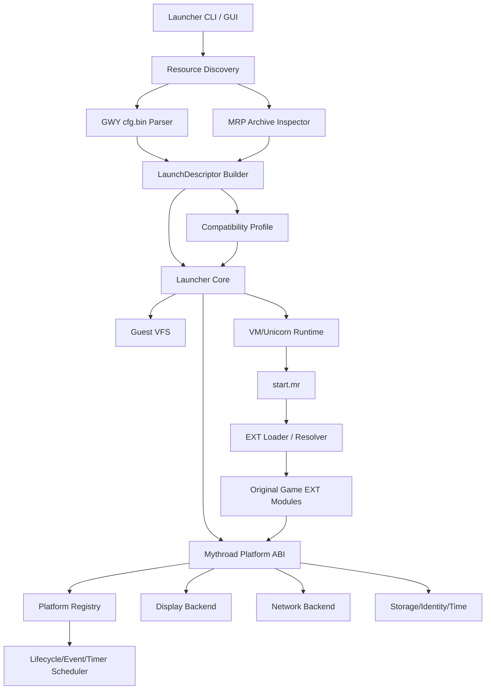

# 目标架构：通用 GWY/MRP 独立启动器

## 1. 总体分层



## 2. 仓库建议结构

```text
jjfb-gwy-launcher/
  CMakeLists.txt
  README.md
  third_party/
    vmrp_upstream/              # 固定 commit/快照，尽量不直接改
    unicorn/
    SDL2/
  src/
    app/
      launcher_main.c
      launcher_cli.c
    launcher/
      launch_descriptor.c
      launch_context.c
      launch_state_machine.c
    formats/
      mrp_archive.c
      mrp_archive.h
      gwy_cfg.c
      gwy_cfg.h
      reg_ext.c
      reg_ext.h
    vfs/
      guest_path.c
      guest_vfs.c
      guest_vfs.h
    runtime/
      vm_runtime.c
      ext_loader.c
      ext_resolver.c
      platform_table.c
    platform/
      platform_registry.c
      platform_scheduler.c
      platform_lifecycle.c
      platform_memory.c
      platform_file.c
      platform_display.c
      platform_timer.c
      platform_event.c
      platform_network.c
      platform_identity.c
      platform_storage.c
    profiles/
      profile_loader.c
      profile_validation.c
    trace/
      trace_event.c
      trace_jsonl.c
  profiles/
    jjfb.json
    other_games/
  tools/
    mrp_inspect.py
    gwy_cfg_inspect.py
  tests/
    unit/
    integration/
    fixtures/
  legacy_lab/                   # 当前 bootkit 的只读证据，不参与 clean build
  docs/
```

## 3. 核心数据模型

### `LaunchDescriptor`

```c
typedef struct {
    char resource_root[PATH_MAX];
    char target_mrp[256];
    char entry_member[64];
    int cfg_index;
    int napptype;
    int nextid;
    int ncode;
    int narg;
    int narg1;
    char nmrpname[256];
    char flags[8][32];
    uint32_t appid;
    uint32_t appver;
    uint8_t target_sha256[32];
} LaunchDescriptor;
```

原则：

- cfg 字段集中在结构体；
- 参数字符串只在 serializer 中生成；
- `bridge.c`/platform service 不知道 index 36；
- target hash 在启动前和退出后校验。

### `PlatformRegistry`

```c
typedef struct {
    GuestFn family_handler;
    GuestFn periodic_handler;
    GuestFn enqueue_handler;
    GuestFn resume_callback;
    GuestPtr ext_chunk;
    TimerRegistry timers;
    EventQueue events;
} PlatformRegistry;
```

它由 guest 的平台注册调用填写。scheduler 只调用已注册项，不使用 JJFB 固定地址。

### `CompatibilityProfile`

profile 只描述差异：

- target hash；
- cfg index；
- display；
- SDK identity；
- MRP member alias；
- 某个 entry return 的安全解释；
- 已知平台 capability 开关。

profile **不得**描述：

- `ERW+0xB70=1`；
- “调用 0x2DADC4”；
- “把 ui_mode 设成 0x45”；
- 任意 game code address。

## 4. 四个执行模式

### `inspect`

只解析资源、cfg、MRP、reg.ext，不执行 guest。

```text
gwy_launcher inspect --root ... --cfg gwy/cfg.bin
```

### `launch`

日常独立启动目标 MRP。

```text
gwy_launcher launch --profile profiles/jjfb.json
```

### `trace-shell`

研究模式：运行或静态审计 `gbrwcore/gamelist`，只采集启动契约，不作为日常方案。

### `replay`

使用记录的平台注册/事件 trace 对 scheduler 做确定性回放；不依赖游戏固定地址。

## 5. 为什么必须把 scheduler 变成一等模块

当前研究已经证明 robotol 会向平台注册：

- family handler；
- timer/periodic handler；
- enqueue handler；
- callback；
- ext chunk。

旧实现的问题是：注册表、调用时机和 game-state 实验都混在 `bridge.c`。

新 scheduler 应有明确状态：

```text
CREATED
→ PLATFORM_READY
→ TARGET_LOADED
→ EXT_INITIALIZED
→ FOREGROUND
→ RUNNING
→ PAUSED
→ RESUMED
→ STOPPING
→ STOPPED
```

每个状态只产生文档化的通用事件：

- `on_platform_ready`
- `on_app_start`
- `on_foreground`
- `on_timer_due`
- `on_input`
- `on_pause`
- `on_resume`
- `on_exit`

是否映射为某个 family app/code，必须由平台协议分析或 profile capability 决定，不能由 JJFB 的 B71 结果反推。

## 6. 启动器与模拟器的边界

用户不希望重做完整模拟器，但运行 ARM/Thumb EXT 必然需要一个最小平台 runtime。正确边界是：

```text
只实现本地 MRP 游戏启动与运行所需的 Mythroad ABI；
不追求所有机型、所有 MRP、所有 UI 控件的完整兼容；
但所实现的 ABI 必须通用、注册式、可测试，不得写成 JJFB 固定地址补丁。
```
