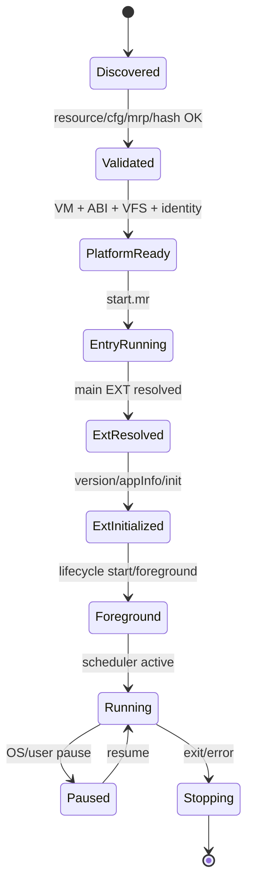

# GWY Launcher 的启动契约

## 1. JJFB 已知配置

```text
cfg index = 36
title slice in cfg = 风暴(火爆公测)
product name       = 机甲风暴（由资源/既有记录识别，勿混同字段原文）
icon      = ng_jjfb.gif
target    = gwy/jjfb.mrp
napptype  = 12
nextid    = 482
ncode     = 512
narg      = 0
narg1     = 1
nmrpname  = gwy/jjfb.mrp
flag      = gwyblink
APPID     = 400101
APPVER    = 12
```

参数序列化：

```text
napptype=12_nextid=482_ncode=512_narg=0_narg1=1_nmrpname=gwy/jjfb.mrp_gwyblink
```

## 2. `LaunchDescriptor` 构建顺序

```text
1. 解析 profile
2. 定位 resource root
3. 读取 cfg.bin/index 36
4. 对 cfg 字段与 profile 期望做交叉验证
5. 读取 target MRP header
6. 校验 APPID/APPVER、hash、entry member
7. 生成 SDK identity/key
8. 建立 read-only canonical + writable overlay VFS
9. 构造参数字符串
10. 进入 platform bootstrap
```

任何一步不一致应停止，而不是自动“修成能跑”。

## 3. 推荐启动状态机



## 4. `start.mr`/EXT handoff

当前证据链：

```text
start.mr (stored 1514)
→ sdk_key.dat
→ mrc_loader.ext (stored 219)
→ logical cfunction.ext request
→ robotol.ext (stored 161178)
```

正确实现：

- `start.mr` 仍由原始 Mythroad Lua/runtime 执行；
- SDK key 由 identity 服务生成并放入 VFS；
- MRP 成员查找由 `ExtResolver` 完成；
- alias 在 resolver/profile 层完成；
- 不在 guest 内存中改请求字符串；
- EXT 注册后记录 helper/P/ER_RW 只是 runtime 内部对象，不作为外壳业务状态。

## 5. EXT 初始化顺序

已验证的 JJFB 最低顺序：

```text
method/version code 6
method/appInfo code 8
method/init code 0
```

随后 platform 应根据标准 lifecycle 调用 pause/resume/timer/event，而不是因为某个 JJFB 地址没执行就人工补 event。

关于 `start_dsm` 返回 1：

- 当前证据显示在 robotol 已加载的条件下，返回 1 可表示 `MR_IGNORE`/handoff；
- 这应作为 profile 的“accepted entry return”并带严格后置条件；
- 不能全局把所有返回 1 当成功；
- 后置条件至少包括：目标 EXT 已由 resolver 找到、解压、注册、可执行。

## 6. 生命周期契约

新实现要通过研究 Mythroad API/其他 MRP 对照，明确：

```text
init
foreground/start
resume
periodic timer
event/input
pause
exit
```

在协议完全锁定前，scheduler 应支持两种模式：

### strict

只调用文档和跨 MRP 对照确认的生命周期。

### trace-assisted

根据 shell trace 或 profile 的高层 lifecycle mapping 调用已注册 handler；profile 只能描述事件类型/代码，不能含 JJFB 内存地址。

## 7. “外壳启动完成”的最低验收

```text
cfg 记录解析成功
original MRP hash unchanged
start.mr loaded
main EXT resolved by resolver
EXT init=0
platform registrations captured
scheduler entered RUNNING
no game-state forcing
```

是否出现 splash 不属于启动契约的必要验收。
